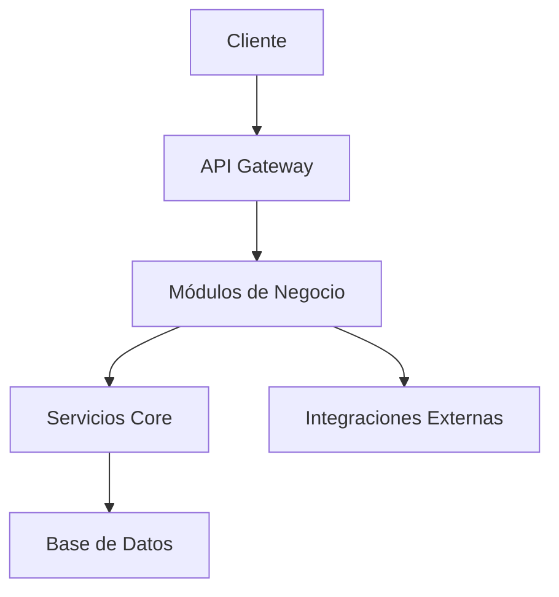

# Arquitectura del Sistema - Chat-Bot-1-2

## 📋 Resumen Ejecutivo

Este documento describe la arquitectura refactorizada del sistema Chat-Bot-1-2, diseñada para ser escalable, mantenible y modular.

## 🏗️ Estructura del Proyecto

### Problemas Identificados en la Estructura Anterior:
- **Servidor monolítico**: Todo el código en `server.js` (3267 líneas)
- **Servicios dispersos**: Lógica de negocio mezclada con rutas
- **Configuración fragmentada**: Variables de entorno dispersas
- **Frontend no modular**: Archivos HTML con CSS y JS embebido
- **Falta de documentación**: Sin documentación técnica estructurada

### Nueva Estructura Propuesta:

```
Chat-Bot-1-2/
├── docs/                           # 📚 Documentación
│   ├── ARCHITECTURE.md             # Arquitectura del sistema
│   ├── API.md                      # Documentación de APIs
│   ├── DEPLOYMENT.md               # Guía de despliegue
│   └── modules/                    # Documentación por módulos
├── src/                            # 🔧 Código fuente principal
│   ├── config/                     # ⚙️ Configuración centralizada
│   ├── core/                       # 🏛️ Funcionalidades core
│   ├── modules/                    # 📦 Módulos de negocio
│   │   ├── auth/                   # 🔐 Autenticación
│   │   ├── contacts/               # 👥 Gestión de contactos
│   │   ├── messaging/              # 💬 Sistema de mensajería
│   │   ├── templates/              # 📄 Gestión de plantillas
│   │   ├── automation/             # 🤖 Automatización
│   │   ├── analytics/              # 📊 Analíticas
│   │   ├── integrations/           # 🔗 Integraciones
│   │   └── ai/                     # 🧠 Inteligencia Artificial
│   ├── shared/                     # 🔄 Utilidades compartidas
│   └── server/                     # 🖥️ Configuración del servidor
├── client/                         # 🎨 Frontend
│   ├── components/                 # 🧩 Componentes reutilizables
│   ├── pages/                      # 📄 Páginas
│   ├── assets/                     # 🎭 Recursos estáticos
│   └── utils/                      # 🛠️ Utilidades frontend
├── tests/                          # 🧪 Testing
├── scripts/                        # 📜 Scripts de automatización
└── data/                           # 💾 Datos persistentes
```

## 🎯 Principios de Diseño

### 1. **Separación de Responsabilidades**
- Cada módulo tiene una responsabilidad específica
- Servicios independientes y reutilizables
- Configuración centralizada

### 2. **Escalabilidad**
- Arquitectura modular que permite agregar funcionalidades
- Servicios desacoplados
- APIs bien definidas

### 3. **Mantenibilidad**
- Código bien documentado
- Estructura clara y consistente
- Testing automatizado

### 4. **Reutilización**
- Componentes compartidos
- Utilidades comunes
- Patrones consistentes

## 📦 Módulos del Sistema

### 🔐 Auth (Autenticación)
- Gestión de usuarios y sesiones
- Tokens JWT
- Middleware de autenticación

### 👥 Contacts (Contactos)
- CRUD de contactos
- Gestión de etiquetas
- Segmentación de audiencias

### 💬 Messaging (Mensajería)
- Envío de mensajes
- Gestión de conversaciones
- Cola de mensajes

### 📄 Templates (Plantillas)
- Gestión de plantillas
- Variables dinámicas
- Aprobación de plantillas

### 🤖 Automation (Automatización)
- Reglas de automatización
- Triggers y acciones
- Flujos de trabajo

### 📊 Analytics (Analíticas)
- Métricas de rendimiento
- Reportes
- Dashboard de analíticas

### 🔗 Integrations (Integraciones)
- 360Dialog API
- Webhooks
- APIs externas

### 🧠 AI (Inteligencia Artificial)
- LMStudio integration
- Procesamiento de lenguaje natural
- Respuestas automáticas

## 🔄 Flujo de Datos



## 🛠️ Stack Tecnológico

- **Backend**: Node.js + Express
- **Frontend**: HTML5 + CSS3 + JavaScript (Vanilla)
- **Base de Datos**: JSON Files (Local)
- **Integraciones**: 360Dialog API, LMStudio
- **Testing**: Jest (a implementar)
- **Documentación**: Markdown

## 📈 Beneficios de la Refactorización

1. **Mantenibilidad**: Código más limpio y organizado
2. **Escalabilidad**: Fácil agregar nuevas funcionalidades
3. **Testing**: Estructura que facilita las pruebas
4. **Documentación**: Documentación técnica completa
5. **Colaboración**: Estructura clara para equipos
6. **Performance**: Optimización de recursos

## 🚀 Plan de Migración

1. **Fase 1**: Crear nueva estructura de carpetas
2. **Fase 2**: Refactorizar servicios backend
3. **Fase 3**: Modularizar frontend
4. **Fase 4**: Implementar testing
5. **Fase 5**: Documentación completa
6. **Fase 6**: Validación y optimización

---

*Documento creado como parte de la refactorización del sistema Chat-Bot-1-2*