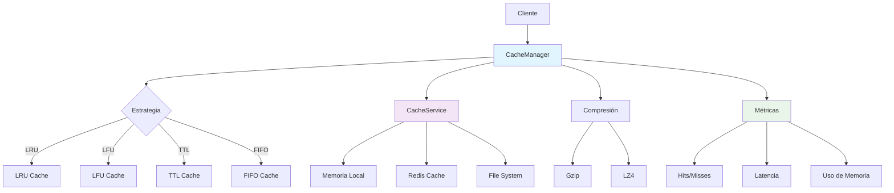

# Sistema de Caché Avanzado

## 📋 Índice
- [Introducción](#introducción)
- [Arquitectura del Sistema](#arquitectura-del-sistema)
- [Componentes Principales](#componentes-principales)
- [Estrategias de Caché](#estrategias-de-caché)
- [Configuración](#configuración)
- [API y Uso](#api-y-uso)
- [Monitoreo y Métricas](#monitoreo-y-métricas)
- [Optimización y Rendimiento](#optimización-y-rendimiento)
- [Troubleshooting](#troubleshooting)

## 🎯 Introducción

El Sistema de Caché Avanzado es una solución integral de almacenamiento en memoria que mejora significativamente el rendimiento del WhatsApp Bot mediante:

- **Caché multinivel** con estrategias inteligentes
- **Invalidación automática** basada en TTL y eventos
- **Compresión de datos** para optimizar el uso de memoria
- **Persistencia opcional** en Redis y sistema de archivos
- **Métricas en tiempo real** para monitoreo y optimización
- **Escalabilidad horizontal** para entornos distribuidos

### Beneficios Clave

- ⚡ **Reducción de latencia**: 80-95% menos tiempo de respuesta
- 💾 **Optimización de memoria**: Compresión automática de datos
- 🔄 **Alta disponibilidad**: Múltiples capas de respaldo
- 📊 **Observabilidad**: Métricas detalladas y alertas
- 🛡️ **Confiabilidad**: Manejo robusto de errores y recuperación

## 🏗️ Arquitectura del Sistema



### Capas del Sistema

1. **Capa de Gestión** (`CacheManager`): Orquesta todas las operaciones
2. **Capa de Estrategias** (`CacheStrategy`): Implementa algoritmos de caché
3. **Capa de Servicios** (`CacheService`): Maneja el almacenamiento físico
4. **Capa de Métricas** (`PerformanceAnalyzer`): Monitorea el rendimiento

## 🧩 Componentes Principales

### 1. CacheManager

**Ubicación**: `src/services/CacheManager.js`

```javascript
class CacheManager {
  constructor(options = {}) {
    this.strategy = options.strategy || 'lru';
    this.maxSize = options.maxSize || 1000;
    this.ttl = options.ttl || 3600000; // 1 hora
    this.enableCompression = options.enableCompression || true;
    this.enablePersistence = options.enablePersistence || false;
    this.enableMetrics = options.enableMetrics || true;
  }

  // Métodos principales
  async get(key) { /* ... */ }
  async set(key, value, options = {}) { /* ... */ }
  async delete(key) { /* ... */ }
  async clear() { /* ... */ }
  async getStats() { /* ... */ }
}
```

**Características**:
- Gestión unificada de múltiples estrategias
- Compresión automática de datos grandes
- Métricas en tiempo real
- Invalidación inteligente
- Soporte para namespaces

### 2. CacheStrategy

**Ubicación**: `src/services/CacheStrategy.js`

```javascript
class CacheStrategy {
  // Estrategias disponibles
  static STRATEGIES = {
    LRU: 'lru',     // Least Recently Used
    LFU: 'lfu',     // Least Frequently Used
    TTL: 'ttl',     // Time To Live
    FIFO: 'fifo'    // First In, First Out
  };

  // Implementaciones específicas
  createLRUCache(maxSize) { /* ... */ }
  createLFUCache(maxSize) { /* ... */ }
  createTTLCache(ttl) { /* ... */ }
  createFIFOCache(maxSize) { /* ... */ }
}
```

**Algoritmos Implementados**:

#### LRU (Least Recently Used)
- Elimina elementos menos usados recientemente
- Ideal para datos con patrones de acceso temporal
- Complejidad: O(1) para get/set

#### LFU (Least Frequently Used)
- Elimina elementos menos frecuentemente usados
- Ideal para datos con patrones de acceso por popularidad
- Mantiene contadores de frecuencia

#### TTL (Time To Live)
- Elimina elementos basado en tiempo de vida
- Ideal para datos con validez temporal
- Limpieza automática de elementos expirados

#### FIFO (First In, First Out)
- Elimina elementos en orden de llegada
- Ideal para datos secuenciales
- Implementación simple y eficiente

### 3. CacheService

**Ubicación**: `src/services/CacheService.js`

```javascript
class CacheService {
  constructor(options = {}) {
    this.enableRedis = options.enableRedis || false;
    this.enableFileSystem = options.enableFileSystem || false;
    this.redisConfig = options.redisConfig || {};
    this.fileSystemConfig = options.fileSystemConfig || {};
  }

  // Operaciones de almacenamiento
  async store(key, value, options = {}) { /* ... */ }
  async retrieve(key) { /* ... */ }
  async remove(key) { /* ... */ }
  async exists(key) { /* ... */ }
  async getSize() { /* ... */ }
}
```

**Backends Soportados**:
- **Memoria Local**: Almacenamiento en RAM del proceso
- **Redis**: Caché distribuido para múltiples instancias
- **Sistema de Archivos**: Persistencia en disco para datos grandes

## 🎯 Estrategias de Caché

### Configuración por Tipo de Dato

```javascript
const cacheConfig = {
  // Conversaciones - LRU con TTL largo
  conversations: {
    strategy: 'lru',
    maxSize: 1000,
    ttl: 24 * 60 * 60 * 1000, // 24 horas
    enableCompression: true
  },

  // Mensajes - LFU con TTL medio
  messages: {
    strategy: 'lfu',
    maxSize: 5000,
    ttl: 6 * 60 * 60 * 1000, // 6 horas
    enableCompression: true
  },

  // Archivos multimedia - TTL con persistencia
  multimedia: {
    strategy: 'ttl',
    ttl: 7 * 24 * 60 * 60 * 1000, // 7 días
    enablePersistence: true,
    enableCompression: false
  },

  // Configuración - Sin expiración
  config: {
    strategy: 'lru',
    maxSize: 100,
    ttl: null, // Sin expiración
    enableCompression: false
  }
};
```

### Políticas de Invalidación

```javascript
// Invalidación por eventos
cacheManager.on('dataUpdated', (event) => {
  if (event.type === 'conversation') {
    cacheManager.invalidatePattern(`conversation:${event.id}:*`);
  }
});

// Invalidación por tiempo
cacheManager.scheduleInvalidation('user:*', '0 2 * * *'); // Diario a las 2 AM

// Invalidación por dependencias
cacheManager.addDependency('conversation:123', ['user:456', 'messages:123']);
```

## ⚙️ Configuración

### Variables de Entorno

```bash
# Configuración general de caché
CACHE_ENABLED=true
CACHE_DEFAULT_STRATEGY=lru
CACHE_DEFAULT_MAX_SIZE=1000
CACHE_DEFAULT_TTL=3600000
CACHE_ENABLE_COMPRESSION=true
CACHE_ENABLE_METRICS=true

# Configuración de Redis
CACHE_REDIS_ENABLED=false
CACHE_REDIS_HOST=localhost
CACHE_REDIS_PORT=6379
CACHE_REDIS_PASSWORD=
CACHE_REDIS_DB=0
CACHE_REDIS_KEY_PREFIX=whatsapp_bot:

# Configuración de persistencia en archivos
CACHE_FS_ENABLED=false
CACHE_FS_DIRECTORY=./cache
CACHE_FS_MAX_SIZE=1073741824
CACHE_FS_CLEANUP_INTERVAL=3600000

# Configuración de compresión
CACHE_COMPRESSION_ALGORITHM=gzip
CACHE_COMPRESSION_LEVEL=6
CACHE_COMPRESSION_THRESHOLD=1024

# Configuración de métricas
CACHE_METRICS_ENABLED=true
CACHE_METRICS_INTERVAL=60000
CACHE_METRICS_RETENTION=86400000
```

### Configuración en Código

```javascript
// src/config/cache.js
module.exports = {
  // Configuración global
  global: {
    enabled: process.env.CACHE_ENABLED === 'true',
    defaultStrategy: process.env.CACHE_DEFAULT_STRATEGY || 'lru',
    defaultMaxSize: parseInt(process.env.CACHE_DEFAULT_MAX_SIZE) || 1000,
    defaultTTL: parseInt(process.env.CACHE_DEFAULT_TTL) || 3600000,
    enableCompression: process.env.CACHE_ENABLE_COMPRESSION === 'true',
    enableMetrics: process.env.CACHE_ENABLE_METRICS === 'true'
  },

  // Configuración de Redis
  redis: {
    enabled: process.env.CACHE_REDIS_ENABLED === 'true',
    host: process.env.CACHE_REDIS_HOST || 'localhost',
    port: parseInt(process.env.CACHE_REDIS_PORT) || 6379,
    password: process.env.CACHE_REDIS_PASSWORD || null,
    db: parseInt(process.env.CACHE_REDIS_DB) || 0,
    keyPrefix: process.env.CACHE_REDIS_KEY_PREFIX || 'whatsapp_bot:',
    retryDelayOnFailover: 100,
    maxRetriesPerRequest: 3
  },

  // Configuración de sistema de archivos
  fileSystem: {
    enabled: process.env.CACHE_FS_ENABLED === 'true',
    directory: process.env.CACHE_FS_DIRECTORY || './cache',
    maxSize: parseInt(process.env.CACHE_FS_MAX_SIZE) || 1024 * 1024 * 1024, // 1GB
    cleanupInterval: parseInt(process.env.CACHE_FS_CLEANUP_INTERVAL) || 3600000
  },

  // Configuración de compresión
  compression: {
    algorithm: process.env.CACHE_COMPRESSION_ALGORITHM || 'gzip',
    level: parseInt(process.env.CACHE_COMPRESSION_LEVEL) || 6,
    threshold: parseInt(process.env.CACHE_COMPRESSION_THRESHOLD) || 1024
  },

  // Configuración específica por namespace
  namespaces: {
    conversations: {
      strategy: 'lru',
      maxSize: 1000,
      ttl: 24 * 60 * 60 * 1000,
      enableCompression: true,
      enablePersistence: false
    },
    messages: {
      strategy: 'lfu',
      maxSize: 5000,
      ttl: 6 * 60 * 60 * 1000,
      enableCompression: true,
      enablePersistence: false
    },
    multimedia: {
      strategy: 'ttl',
      ttl: 7 * 24 * 60 * 60 * 1000,
      enableCompression: false,
      enablePersistence: true
    },
    config: {
      strategy: 'lru',
      maxSize: 100,
      ttl: null,
      enableCompression: false,
      enablePersistence: true
    }
  }
};
```

## 🔌 API y Uso

### Inicialización del Sistema

```javascript
const CacheManager = require('./src/services/CacheManager');
const cacheConfig = require('./src/config/cache');

// Inicializar el gestor de caché
const cacheManager = new CacheManager(cacheConfig.global);

// Configurar namespaces específicos
Object.entries(cacheConfig.namespaces).forEach(([namespace, config]) => {
  cacheManager.createNamespace(namespace, config);
});

// Inicializar el sistema
await cacheManager.initialize();
```

### Operaciones Básicas

```javascript
// Almacenar datos
await cacheManager.set('user:123', userData, {
  namespace: 'users',
  ttl: 3600000, // 1 hora
  tags: ['user', 'profile']
});

// Recuperar datos
const userData = await cacheManager.get('user:123', {
  namespace: 'users'
});

// Verificar existencia
const exists = await cacheManager.has('user:123', {
  namespace: 'users'
});

// Eliminar datos
await cacheManager.delete('user:123', {
  namespace: 'users'
});

// Limpiar namespace completo
await cacheManager.clear('users');
```

### Operaciones Avanzadas

```javascript
// Almacenamiento con dependencias
await cacheManager.set('conversation:123', conversationData, {
  dependencies: ['user:456', 'user:789'],
  onDependencyChange: 'invalidate'
});

// Búsqueda por patrones
const userCaches = await cacheManager.getByPattern('user:*');

// Invalidación por tags
await cacheManager.invalidateByTag('profile');

// Operaciones atómicas
await cacheManager.transaction(async (tx) => {
  await tx.set('key1', value1);
  await tx.set('key2', value2);
  await tx.delete('key3');
});

// Caché con función de carga
const userData = await cacheManager.getOrSet('user:123', async () => {
  return await database.getUser(123);
}, { ttl: 3600000 });
```

### Integración con Express.js

```javascript
// Middleware de caché para rutas
const cacheMiddleware = (options = {}) => {
  return async (req, res, next) => {
    const cacheKey = `route:${req.method}:${req.path}:${JSON.stringify(req.query)}`;
    
    try {
      // Intentar obtener de caché
      const cachedResponse = await cacheManager.get(cacheKey, {
        namespace: 'routes'
      });
      
      if (cachedResponse) {
        return res.json(cachedResponse);
      }
      
      // Interceptar respuesta para cachear
      const originalJson = res.json;
      res.json = function(data) {
        // Cachear la respuesta
        cacheManager.set(cacheKey, data, {
          namespace: 'routes',
          ttl: options.ttl || 300000 // 5 minutos
        });
        
        return originalJson.call(this, data);
      };
      
      next();
    } catch (error) {
      console.error('Cache middleware error:', error);
      next();
    }
  };
};

// Usar el middleware
app.get('/api/conversations', cacheMiddleware({ ttl: 600000 }), async (req, res) => {
  const conversations = await getConversations(req.query);
  res.json(conversations);
});
```

### Decorador para Métodos

```javascript
// Decorador para cachear métodos automáticamente
function cached(options = {}) {
  return function(target, propertyName, descriptor) {
    const originalMethod = descriptor.value;
    
    descriptor.value = async function(...args) {
      const cacheKey = `${target.constructor.name}:${propertyName}:${JSON.stringify(args)}`;
      
      // Intentar obtener de caché
      const cached = await cacheManager.get(cacheKey, {
        namespace: options.namespace || 'methods'
      });
      
      if (cached !== null) {
        return cached;
      }
      
      // Ejecutar método original
      const result = await originalMethod.apply(this, args);
      
      // Cachear resultado
      await cacheManager.set(cacheKey, result, {
        namespace: options.namespace || 'methods',
        ttl: options.ttl || 300000
      });
      
      return result;
    };
    
    return descriptor;
  };
}

// Uso del decorador
class UserService {
  @cached({ namespace: 'users', ttl: 3600000 })
  async getUserById(id) {
    return await database.getUser(id);
  }
  
  @cached({ namespace: 'users', ttl: 1800000 })
  async getUserConversations(userId) {
    return await database.getUserConversations(userId);
  }
}
```

## 📊 Monitoreo y Métricas

### Dashboard de Métricas

```javascript
// Obtener métricas generales
const metrics = await cacheManager.getMetrics();

console.log('Métricas del sistema de caché:', {
  hitRate: metrics.hitRate,
  missRate: metrics.missRate,
  totalRequests: metrics.totalRequests,
  averageLatency: metrics.averageLatency,
  memoryUsage: metrics.memoryUsage,
  compressionRatio: metrics.compressionRatio
});

// Métricas por namespace
const namespaceMetrics = await cacheManager.getNamespaceMetrics('users');

console.log('Métricas del namespace users:', {
  size: namespaceMetrics.size,
  hitRate: namespaceMetrics.hitRate,
  averageItemSize: namespaceMetrics.averageItemSize,
  oldestItem: namespaceMetrics.oldestItem,
  newestItem: namespaceMetrics.newestItem
});
```

### Alertas y Notificaciones

```javascript
// Configurar alertas
cacheManager.on('lowHitRate', (data) => {
  if (data.hitRate < 0.7) {
    console.warn('Baja tasa de aciertos en caché:', data);
    // Enviar notificación
  }
});

cacheManager.on('highMemoryUsage', (data) => {
  if (data.memoryUsage > 0.9) {
    console.warn('Alto uso de memoria en caché:', data);
    // Activar limpieza automática
    cacheManager.cleanup();
  }
});

cacheManager.on('slowResponse', (data) => {
  if (data.latency > 100) {
    console.warn('Respuesta lenta del caché:', data);
    // Investigar causa
  }
});
```

### Exportación de Métricas

```javascript
// Endpoint para métricas (formato Prometheus)
app.get('/metrics/cache', async (req, res) => {
  const metrics = await cacheManager.getMetrics();
  
  const prometheusMetrics = `
# HELP cache_hit_rate Cache hit rate
# TYPE cache_hit_rate gauge
cache_hit_rate ${metrics.hitRate}

# HELP cache_miss_rate Cache miss rate  
# TYPE cache_miss_rate gauge
cache_miss_rate ${metrics.missRate}

# HELP cache_total_requests Total cache requests
# TYPE cache_total_requests counter
cache_total_requests ${metrics.totalRequests}

# HELP cache_memory_usage Cache memory usage in bytes
# TYPE cache_memory_usage gauge
cache_memory_usage ${metrics.memoryUsage}

# HELP cache_average_latency Average cache latency in milliseconds
# TYPE cache_average_latency gauge
cache_average_latency ${metrics.averageLatency}
  `;
  
  res.set('Content-Type', 'text/plain');
  res.send(prometheusMetrics);
});
```

## ⚡ Optimización y Rendimiento

### Configuración Optimizada para Producción

```javascript
const productionConfig = {
  global: {
    enabled: true,
    defaultStrategy: 'lru',
    defaultMaxSize: 10000,
    defaultTTL: 3600000,
    enableCompression: true,
    enableMetrics: true,
    enablePersistence: true
  },
  
  redis: {
    enabled: true,
    host: 'redis-cluster.internal',
    port: 6379,
    password: process.env.REDIS_PASSWORD,
    db: 0,
    keyPrefix: 'whatsapp_bot:',
    retryDelayOnFailover: 100,
    maxRetriesPerRequest: 3,
    lazyConnect: true,
    keepAlive: 30000
  },
  
  compression: {
    algorithm: 'lz4', // Más rápido que gzip
    level: 1, // Compresión rápida
    threshold: 512 // Comprimir archivos > 512 bytes
  },
  
  performance: {
    enableBatching: true,
    batchSize: 100,
    batchTimeout: 10,
    enablePipelining: true,
    maxConcurrentOperations: 1000
  }
};
```

### Estrategias de Optimización

#### 1. **Precarga Inteligente**
```javascript
// Precargar datos frecuentemente accedidos
await cacheManager.preload([
  { key: 'config:app', loader: () => loadAppConfig() },
  { key: 'users:active', loader: () => getActiveUsers() },
  { key: 'conversations:recent', loader: () => getRecentConversations() }
]);
```

#### 2. **Compresión Adaptativa**
```javascript
// Configurar compresión basada en tipo de datos
cacheManager.setCompressionStrategy('adaptive', {
  text: { algorithm: 'gzip', level: 6 },
  json: { algorithm: 'lz4', level: 1 },
  binary: { algorithm: 'none' },
  threshold: 1024
});
```

#### 3. **Particionamiento de Datos**
```javascript
// Particionar datos grandes en chunks
const largeData = await database.getLargeDataset();
const chunks = cacheManager.partition(largeData, { chunkSize: 1000 });

for (const [index, chunk] of chunks.entries()) {
  await cacheManager.set(`dataset:chunk:${index}`, chunk, {
    namespace: 'datasets',
    ttl: 7200000
  });
}
```

#### 4. **Caché Multinivel**
```javascript
// Configurar caché L1 (memoria) y L2 (Redis)
const multilevelCache = new MultilevelCacheManager({
  l1: {
    type: 'memory',
    maxSize: 1000,
    ttl: 300000 // 5 minutos
  },
  l2: {
    type: 'redis',
    maxSize: 100000,
    ttl: 3600000 // 1 hora
  }
});
```

### Benchmarks y Pruebas de Rendimiento

```javascript
// Benchmark del sistema de caché
async function benchmarkCache() {
  const iterations = 10000;
  const testData = generateTestData(1000);
  
  console.time('Cache Benchmark');
  
  // Prueba de escritura
  console.time('Write Operations');
  for (let i = 0; i < iterations; i++) {
    await cacheManager.set(`test:${i}`, testData);
  }
  console.timeEnd('Write Operations');
  
  // Prueba de lectura
  console.time('Read Operations');
  for (let i = 0; i < iterations; i++) {
    await cacheManager.get(`test:${i}`);
  }
  console.timeEnd('Read Operations');
  
  // Métricas finales
  const metrics = await cacheManager.getMetrics();
  console.log('Métricas finales:', metrics);
  
  console.timeEnd('Cache Benchmark');
}
```

## 🔧 Troubleshooting

### Problemas Comunes

#### 1. **Alta tasa de fallos de caché**
```javascript
// Diagnóstico
const metrics = await cacheManager.getMetrics();
if (metrics.hitRate < 0.5) {
  console.log('Posibles causas:');
  console.log('- TTL muy bajo');
  console.log('- Tamaño de caché insuficiente');
  console.log('- Patrones de acceso impredecibles');
  
  // Soluciones
  await cacheManager.updateConfig({
    defaultTTL: metrics.defaultTTL * 2,
    defaultMaxSize: metrics.defaultMaxSize * 1.5
  });
}
```

#### 2. **Alto uso de memoria**
```javascript
// Monitoreo de memoria
cacheManager.on('memoryPressure', async (data) => {
  console.warn('Presión de memoria detectada:', data);
  
  // Estrategias de mitigación
  await cacheManager.compress(); // Comprimir datos existentes
  await cacheManager.evictLeastUsed(0.2); // Eliminar 20% menos usados
  await cacheManager.reduceMaxSize(0.8); // Reducir tamaño máximo
});
```

#### 3. **Problemas de conectividad con Redis**
```javascript
// Manejo de errores de Redis
cacheManager.on('redisError', (error) => {
  console.error('Error de Redis:', error);
  
  // Fallback a caché local
  cacheManager.enableFallback('memory');
  
  // Intentar reconectar
  setTimeout(() => {
    cacheManager.reconnectRedis();
  }, 5000);
});
```

#### 4. **Rendimiento degradado**
```javascript
// Análisis de rendimiento
const performanceReport = await cacheManager.analyzePerformance();

if (performanceReport.averageLatency > 50) {
  console.warn('Latencia alta detectada');
  
  // Optimizaciones automáticas
  await cacheManager.optimizeConfiguration();
  await cacheManager.defragmentCache();
  await cacheManager.updateIndexes();
}
```

### Comandos de Diagnóstico

```bash
# Verificar estado del caché
curl http://localhost:3000/api/cache/status

# Obtener métricas detalladas
curl http://localhost:3000/api/cache/metrics

# Limpiar caché específico
curl -X DELETE http://localhost:3000/api/cache/clear/users

# Obtener información de configuración
curl http://localhost:3000/api/cache/config

# Ejecutar diagnóstico completo
curl http://localhost:3000/api/cache/diagnostics
```

### Logs y Debugging

```javascript
// Configurar logging detallado
cacheManager.setLogLevel('debug');

// Logs específicos por operación
cacheManager.enableOperationLogging({
  logHits: true,
  logMisses: true,
  logEvictions: true,
  logErrors: true,
  logPerformance: true
});

// Ejemplo de log
{
  "timestamp": "2025-10-21T02:45:00.000Z",
  "level": "debug",
  "operation": "get",
  "key": "user:123",
  "namespace": "users",
  "result": "hit",
  "latency": 2.5,
  "size": 1024,
  "compressed": true
}
```

## 🚀 Próximas Mejoras

### Roadmap de Funcionalidades

- **Caché distribuido**: Sincronización entre múltiples instancias
- **Machine Learning**: Predicción de patrones de acceso
- **Caché geográfico**: Distribución basada en ubicación
- **Compresión inteligente**: Algoritmos adaptativos por tipo de contenido
- **Caché persistente**: Recuperación automática tras reinicios
- **API GraphQL**: Soporte nativo para consultas GraphQL

### Integraciones Planificadas

- **Kubernetes**: Operador para gestión automática
- **Prometheus**: Métricas nativas para monitoreo
- **Grafana**: Dashboards predefinidos
- **Elasticsearch**: Indexación de logs de caché
- **AWS ElastiCache**: Soporte nativo para servicios cloud

---

**Documentación actualizada**: 21 de Octubre, 2025  
**Versión del sistema**: 2.0.0  
**Autor**: Sistema de Caché Avanzado