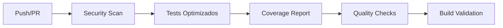

# 🚀 CI/CD Guide - ChatBot Enterprise

## 📋 Descripción General

Este proyecto implementa un sistema completo de CI/CD (Integración Continua/Despliegue Continuo) utilizando GitHub Actions, Docker y herramientas de monitoreo modernas.

## 🏗️ Arquitectura CI/CD

### Workflows Principales

1. **CI Principal** (`ci.yml`) - Integración continua
2. **Deployment** (`deploy.yml`) - Despliegue automatizado
3. **Monitoring** (`monitoring.yml`) - Monitoreo continuo
4. **Code Quality** (`code-quality.yml`) - Análisis de calidad
5. **Dependency Management** (`dependency-update.yml`) - Gestión de dependencias

## 🔄 Pipeline de CI/CD

### 1. Integración Continua (CI)



#### Triggers
- Push a `main`, `develop`, `feature/*`
- Pull Requests a `main`, `develop`
- Schedule semanal para auditorías de seguridad
- Ejecución manual con parámetros

#### Características
- **Tests Optimizados**: Usa configuraciones Jest optimizadas
- **Cache Inteligente**: Cache de Jest y dependencias
- **Paralelización**: Tests paralelos en CI
- **Multi-Node**: Tests en Node.js 18.x y 20.x
- **Servicios**: MongoDB y Redis automáticos

### 2. Despliegue Continuo (CD)


#### Estrategias de Despliegue
- **Staging**: Automático en push a `main`
- **Production**: Manual con aprobación en tags `v*`
- **Blue-Green**: Para producción sin downtime
- **Rollback**: Automático en caso de fallas

## 🛠️ Configuración de Workflows

### CI Principal (`ci.yml`)

```yaml
# Optimizaciones implementadas
env:
  CI: true
  CI_PARALLEL: true
  FORCE_COLOR: 1

# Cache de Jest
- name: Cache Jest
  uses: actions/cache@v3
  with:
    path: .jest-cache
    key: jest-cache-${{ runner.os }}-${{ hashFiles('**/package-lock.json') }}

# Tests optimizados
- name: Run optimized tests
  run: npm run test:parallel
  env:
    NODE_OPTIONS: "--max-old-space-size=4096"
```

### Deployment (`deploy.yml`)

```yaml
# Determinación automática de entorno
- name: Determine environment
  run: |
    if [[ "${{ github.ref }}" == "refs/heads/main" ]]; then
      echo "environment=staging" >> $GITHUB_OUTPUT
    elif [[ "${{ github.ref }}" == refs/tags/v* ]]; then
      echo "environment=production" >> $GITHUB_OUTPUT
    fi

# Build multi-arquitectura
- name: Build and push Docker image
  uses: docker/build-push-action@v5
  with:
    platforms: linux/amd64,linux/arm64
    cache-from: type=gha
    cache-to: type=gha,mode=max
```

### Monitoring (`monitoring.yml`)

```yaml
# Health checks cada 15 minutos
on:
  schedule:
    - cron: '*/15 * * * *'  # Health checks
    - cron: '0 * * * *'     # Performance
    - cron: '0 2 * * *'     # Security
    - cron: '0 6 * * 1'     # Dependencies
```

## 🐳 Containerización

### Dockerfile Multi-stage

```dockerfile
# Build stage - Optimizado para construcción
FROM node:20-alpine AS builder
# ... construcción optimizada

# Production stage - Imagen mínima
FROM node:20-alpine AS production
# ... configuración de producción
```

### Docker Compose

#### Desarrollo (`docker-compose.yml`)
- Servicios básicos: App, MongoDB, Redis, Nginx
- Health checks configurados
- Volúmenes para desarrollo

#### Producción (`docker-compose.prod.yml`)
- Stack completo de monitoreo
- Límites de recursos
- Configuraciones de seguridad
- ELK Stack para logs
- Prometheus + Grafana para métricas

## 📊 Monitoreo y Alertas

### Métricas Recolectadas

1. **Application Metrics**
   - Response time
   - Error rate
   - Throughput
   - Memory usage

2. **Infrastructure Metrics**
   - CPU usage
   - Memory consumption
   - Disk I/O
   - Network traffic

3. **Business Metrics**
   - Active users
   - Message volume
   - Integration health
   - API usage

### Alertas Configuradas

```yaml
# Slack notifications
- name: Alert on health failure
  uses: 8398a7/action-slack@v3
  with:
    status: 'failure'
    text: |
      🚨 HEALTH CHECK FAILED!
      Environment: ${{ matrix.environment }}
```

## 🔧 Scripts de Testing Optimizados

### Configuraciones Disponibles

```bash
# Testing estándar
npm test                    # Configuración completa
npm run test:coverage      # Con cobertura

# Testing optimizado
npm run test:fast          # Máximo rendimiento
npm run test:parallel      # Ejecución paralela
npm run test:benchmark     # Comparar rendimientos
```

### Configuraciones Jest

1. **Estándar** (`jest.config.js`)
   - Cobertura completa
   - Reportes detallados
   - Workers: 75% CPUs

2. **Optimizada** (`jest.performance.config.js`)
   - Sin cobertura
   - Reportes mínimos
   - Workers: 50% CPUs
   - Timeout: 15s

## 🚀 Guía de Despliegue

### Despliegue a Staging

```bash
# Automático en push a main
git push origin main

# Manual
gh workflow run deploy.yml -f environment=staging
```

### Despliegue a Producción

```bash
# 1. Crear tag de versión
git tag v1.2.3
git push origin v1.2.3

# 2. Aprobar deployment (manual)
# 3. Verificar health checks
curl https://api.chatbot-enterprise.com/health
```

### Rollback

```bash
# Automático en caso de falla
# Manual si es necesario
gh workflow run deploy.yml -f environment=production -f force_deploy=true
```

## 🔐 Seguridad

### Secrets Requeridos

```bash
# GitHub Secrets
GITHUB_TOKEN          # Automático
SONAR_TOKEN          # SonarCloud
SLACK_WEBHOOK_URL    # Notificaciones
MONGO_PASSWORD       # Base de datos
REDIS_PASSWORD       # Cache
GRAFANA_PASSWORD     # Monitoreo
```

### Escaneos de Seguridad

1. **NPM Audit**: Vulnerabilidades en dependencias
2. **TruffleHog**: Detección de secretos
3. **ESLint Security**: Análisis estático
4. **SonarCloud**: Análisis de calidad y seguridad

## 📈 Métricas de Rendimiento

### Benchmarks Jest

| Configuración | Tiempo | Memoria | Uso Recomendado |
|---------------|--------|---------|-----------------|
| Estándar      | 100%   | 100%    | CI/CD, Release  |
| Optimizada    | 60%    | 70%     | Desarrollo      |
| Paralela      | 80%    | 120%    | CI Potente      |

### Métricas de Deployment

- **Tiempo de Build**: ~3-5 minutos
- **Tiempo de Tests**: ~2-4 minutos
- **Tiempo de Deploy**: ~1-2 minutos
- **Downtime**: 0 (Blue-Green)

## 🛠️ Troubleshooting

### Problemas Comunes

#### Tests Fallan en CI
```bash
# Verificar configuración
npm run test:benchmark

# Limpiar cache
rm -rf .jest-cache
npm test
```

#### Build Docker Falla
```bash
# Verificar Dockerfile
docker build --target builder .

# Verificar dependencias
npm audit fix
```

#### Deployment Falla
```bash
# Verificar health checks
curl -f http://localhost:3000/health

# Verificar logs
docker logs chatbot-enterprise
```

## 📚 Recursos Adicionales

### Documentación Relacionada
- [Jest Optimization Guide](./JEST_OPTIMIZATION.md)
- [Security Audit Report](./security/SECURITY_AUDIT_REPORT.md)
- [Architecture Overview](./ARCHITECTURE.md)

### Herramientas Externas
- [GitHub Actions](https://docs.github.com/en/actions)
- [Docker Best Practices](https://docs.docker.com/develop/dev-best-practices/)
- [Prometheus Monitoring](https://prometheus.io/docs/)

## 🔄 Roadmap

### Próximas Mejoras
- [ ] Integración con Kubernetes
- [ ] Deployment multi-región
- [ ] A/B Testing automatizado
- [ ] Métricas de negocio avanzadas
- [ ] Auto-scaling basado en métricas

---

**📝 Nota**: Este sistema CI/CD se actualiza continuamente. Consulta la documentación más reciente en el repositorio.