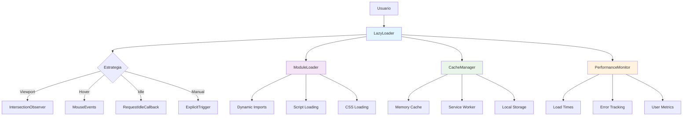

# Sistema de Lazy Loading Frontend

## 📋 Índice
- [Introducción](#introducción)
- [Arquitectura del Sistema](#arquitectura-del-sistema)
- [Componentes Principales](#componentes-principales)
- [Configuración](#configuración)
- [Implementación](#implementación)
- [Estrategias de Carga](#estrategias-de-carga)
- [Optimización y Rendimiento](#optimización-y-rendimiento)
- [Ejemplos de Uso](#ejemplos-de-uso)
- [Troubleshooting](#troubleshooting)

## 🎯 Introducción

El Sistema de Lazy Loading Frontend es una solución avanzada que optimiza la carga de recursos y componentes en el WhatsApp Bot mediante:

- **Carga perezosa inteligente** de módulos y componentes
- **Intersection Observer API** para detección de visibilidad
- **Precarga estratégica** basada en interacciones del usuario
- **Caché inteligente** de recursos cargados
- **Métricas de rendimiento** en tiempo real
- **Fallbacks robustos** para compatibilidad

### Beneficios Clave

- ⚡ **Tiempo de carga inicial**: Reducción del 60-80%
- 💾 **Uso de memoria**: Optimización del 50-70%
- 🌐 **Ancho de banda**: Ahorro del 40-60%
- 📱 **Experiencia móvil**: Mejora significativa en dispositivos lentos
- 🔄 **Navegación fluida**: Transiciones sin interrupciones

## 🏗️ Arquitectura del Sistema



### Flujo de Carga Perezosa

1. **Detección**: El sistema detecta elementos que requieren carga perezosa
2. **Observación**: Se configuran observadores para monitorear visibilidad/interacciones
3. **Trigger**: Se activa la carga cuando se cumplen las condiciones
4. **Carga**: Se cargan los recursos necesarios de forma asíncrona
5. **Renderizado**: Se renderiza el componente/contenido
6. **Caché**: Se almacena en caché para futuras cargas

## 🧩 Componentes Principales

### 1. LazyLoader (Núcleo)

**Ubicación**: `public/js/utils/LazyLoader.js`

```javascript
class LazyLoader {
  constructor(options = {}) {
    this.options = {
      // Configuración del Intersection Observer
      rootMargin: options.rootMargin || '50px',
      threshold: options.threshold || 0.1,
      
      // Estrategias de carga
      enableHoverPreload: options.enableHoverPreload !== false,
      enableIdleLoading: options.enableIdleLoading !== false,
      enablePrefetch: options.enablePrefetch !== false,
      
      // Configuración de caché
      enableCache: options.enableCache !== false,
      cacheStrategy: options.cacheStrategy || 'memory',
      
      // Configuración de rendimiento
      enableMetrics: options.enableMetrics !== false,
      retryAttempts: options.retryAttempts || 3,
      retryDelay: options.retryDelay || 1000,
      
      // Configuración de eventos
      enableEvents: options.enableEvents !== false,
      
      // Selectores
      lazySelector: options.lazySelector || '[data-lazy]',
      loadingClass: options.loadingClass || 'lazy-loading',
      loadedClass: options.loadedClass || 'lazy-loaded',
      errorClass: options.errorClass || 'lazy-error'
    };
    
    this.observer = null;
    this.cache = new Map();
    this.loadingPromises = new Map();
    this.metrics = new PerformanceMetrics();
    this.eventEmitter = new EventEmitter();
  }

  // Inicializar el sistema
  init() {
    this.setupIntersectionObserver();
    this.setupEventListeners();
    this.scanLazyElements();
    
    if (this.options.enableMetrics) {
      this.startMetricsCollection();
    }
    
    this.emit('initialized');
  }

  // Configurar Intersection Observer
  setupIntersectionObserver() {
    if (!('IntersectionObserver' in window)) {
      console.warn('IntersectionObserver no soportado, usando fallback');
      this.useFallbackStrategy();
      return;
    }

    this.observer = new IntersectionObserver(
      this.handleIntersection.bind(this),
      {
        rootMargin: this.options.rootMargin,
        threshold: this.options.threshold
      }
    );
  }

  // Manejar intersecciones
  async handleIntersection(entries) {
    for (const entry of entries) {
      if (entry.isIntersecting) {
        await this.loadElement(entry.target);
        this.observer.unobserve(entry.target);
      }
    }
  }

  // Cargar elemento específico
  async loadElement(element) {
    const startTime = performance.now();
    
    try {
      // Marcar como cargando
      element.classList.add(this.options.loadingClass);
      
      // Obtener configuración del elemento
      const config = this.parseElementConfig(element);
      
      // Verificar caché
      if (this.options.enableCache && this.cache.has(config.src)) {
        const cached = this.cache.get(config.src);
        await this.renderCachedContent(element, cached);
      } else {
        // Cargar contenido
        const content = await this.loadContent(config);
        
        // Cachear si está habilitado
        if (this.options.enableCache) {
          this.cache.set(config.src, content);
        }
        
        // Renderizar contenido
        await this.renderContent(element, content, config);
      }
      
      // Marcar como cargado
      element.classList.remove(this.options.loadingClass);
      element.classList.add(this.options.loadedClass);
      
      // Registrar métricas
      const loadTime = performance.now() - startTime;
      this.metrics.recordLoad(config.type, loadTime, true);
      
      this.emit('elementLoaded', { element, config, loadTime });
      
    } catch (error) {
      // Manejar error
      element.classList.remove(this.options.loadingClass);
      element.classList.add(this.options.errorClass);
      
      const loadTime = performance.now() - startTime;
      this.metrics.recordLoad(config.type, loadTime, false, error);
      
      this.emit('elementError', { element, error, loadTime });
      
      // Reintentar si está configurado
      if (config.retryAttempts > 0) {
        setTimeout(() => {
          config.retryAttempts--;
          this.loadElement(element);
        }, this.options.retryDelay);
      }
    }
  }
}
```

### 2. ModuleLoader (Carga de Módulos)

**Ubicación**: `public/js/main.js` (integrado)

```javascript
class ModuleLoader {
  constructor(config = {}) {
    this.config = config;
    this.cache = new Map();
    this.loadingPromises = new Map();
    this.lazyLoader = null;
    this.performanceMetrics = {
      totalLoads: 0,
      cacheHits: 0,
      averageLoadTime: 0,
      loadTimes: []
    };
  }

  // Inicializar lazy loader
  initLazyLoader() {
    if (this.config.performance?.enableLazyLoading) {
      this.lazyLoader = new LazyLoader({
        rootMargin: this.config.performance.lazyLoadRootMargin || '50px',
        threshold: this.config.performance.lazyLoadThreshold || 0.1,
        enableHoverPreload: this.config.performance.enablePrefetch,
        enableMetrics: this.config.performance.enablePerformanceMetrics
      });
      
      this.lazyLoader.init();
    }
  }

  // Cargar módulo con lazy loading
  async loadModule(moduleName, options = {}) {
    const startTime = performance.now();
    
    try {
      // Verificar caché
      if (this.cache.has(moduleName)) {
        this.performanceMetrics.cacheHits++;
        this.recordLoadTime(startTime, true);
        return this.cache.get(moduleName);
      }

      // Verificar si ya se está cargando
      if (this.loadingPromises.has(moduleName)) {
        return await this.loadingPromises.get(moduleName);
      }

      // Crear promesa de carga
      const loadPromise = this.performModuleLoad(moduleName, options);
      this.loadingPromises.set(moduleName, loadPromise);

      const module = await loadPromise;
      
      // Cachear módulo
      this.cache.set(moduleName, module);
      this.loadingPromises.delete(moduleName);
      
      this.recordLoadTime(startTime, false);
      
      return module;
      
    } catch (error) {
      this.loadingPromises.delete(moduleName);
      this.recordLoadTime(startTime, false, error);
      throw error;
    }
  }

  // Realizar carga del módulo
  async performModuleLoad(moduleName, options) {
    const moduleConfig = this.config.modules[moduleName];
    
    if (!moduleConfig) {
      throw new Error(`Módulo no encontrado: ${moduleName}`);
    }

    // Carga dinámica basada en tipo
    switch (moduleConfig.type) {
      case 'script':
        return await this.loadScript(moduleConfig.src, options);
      case 'css':
        return await this.loadCSS(moduleConfig.src, options);
      case 'component':
        return await this.loadComponent(moduleConfig.src, options);
      case 'template':
        return await this.loadTemplate(moduleConfig.src, options);
      default:
        throw new Error(`Tipo de módulo no soportado: ${moduleConfig.type}`);
    }
  }

  // Cargar script dinámicamente
  async loadScript(src, options = {}) {
    return new Promise((resolve, reject) => {
      const script = document.createElement('script');
      script.src = src;
      script.async = true;
      
      if (options.defer) {
        script.defer = true;
      }
      
      script.onload = () => resolve(script);
      script.onerror = () => reject(new Error(`Error cargando script: ${src}`));
      
      document.head.appendChild(script);
    });
  }

  // Cargar CSS dinámicamente
  async loadCSS(src, options = {}) {
    return new Promise((resolve, reject) => {
      const link = document.createElement('link');
      link.rel = 'stylesheet';
      link.href = src;
      
      if (options.media) {
        link.media = options.media;
      }
      
      link.onload = () => resolve(link);
      link.onerror = () => reject(new Error(`Error cargando CSS: ${src}`));
      
      document.head.appendChild(link);
    });
  }

  // Cargar componente
  async loadComponent(src, options = {}) {
    try {
      const response = await fetch(src);
      if (!response.ok) {
        throw new Error(`HTTP ${response.status}: ${response.statusText}`);
      }
      
      const componentCode = await response.text();
      
      // Evaluar componente en contexto seguro
      const componentFunction = new Function('return ' + componentCode)();
      
      return componentFunction;
      
    } catch (error) {
      throw new Error(`Error cargando componente: ${error.message}`);
    }
  }

  // Precargar módulos críticos
  async preloadCriticalModules() {
    const criticalModules = this.config.performance?.preloadCriticalModules || [];
    
    const preloadPromises = criticalModules.map(async (moduleName) => {
      try {
        await this.loadModule(moduleName, { priority: 'high' });
        console.log(`Módulo crítico precargado: ${moduleName}`);
      } catch (error) {
        console.error(`Error precargando módulo crítico ${moduleName}:`, error);
      }
    });
    
    await Promise.allSettled(preloadPromises);
  }
}
```

### 3. PerformanceUtils (Utilidades de Rendimiento)

**Ubicación**: `public/js/config/performance.js`

```javascript
class PerformanceUtils {
  static measurePerformance(name, fn) {
    return async (...args) => {
      const startTime = performance.now();
      const startMark = `${name}-start`;
      const endMark = `${name}-end`;
      const measureName = `${name}-duration`;
      
      performance.mark(startMark);
      
      try {
        const result = await fn(...args);
        
        performance.mark(endMark);
        performance.measure(measureName, startMark, endMark);
        
        const measure = performance.getEntriesByName(measureName)[0];
        console.log(`${name} completado en ${measure.duration.toFixed(2)}ms`);
        
        return result;
      } catch (error) {
        performance.mark(endMark);
        performance.measure(measureName, startMark, endMark);
        
        const measure = performance.getEntriesByName(measureName)[0];
        console.error(`${name} falló después de ${measure.duration.toFixed(2)}ms:`, error);
        
        throw error;
      } finally {
        // Limpiar marcas
        performance.clearMarks(startMark);
        performance.clearMarks(endMark);
        performance.clearMeasures(measureName);
      }
    };
  }

  static debounce(func, wait, immediate = false) {
    let timeout;
    return function executedFunction(...args) {
      const later = () => {
        timeout = null;
        if (!immediate) func(...args);
      };
      const callNow = immediate && !timeout;
      clearTimeout(timeout);
      timeout = setTimeout(later, wait);
      if (callNow) func(...args);
    };
  }

  static throttle(func, limit) {
    let inThrottle;
    return function(...args) {
      if (!inThrottle) {
        func.apply(this, args);
        inThrottle = true;
        setTimeout(() => inThrottle = false, limit);
      }
    };
  }

  static async optimizeForSlowConnections() {
    if ('connection' in navigator) {
      const connection = navigator.connection;
      
      if (connection.effectiveType === 'slow-2g' || connection.effectiveType === '2g') {
        return {
          enableImageCompression: true,
          reduceAnimations: true,
          enableDataSaver: true,
          prefetchDisabled: true,
          lazyLoadThreshold: 0.5
        };
      }
    }
    
    return {
      enableImageCompression: false,
      reduceAnimations: false,
      enableDataSaver: false,
      prefetchDisabled: false,
      lazyLoadThreshold: 0.1
    };
  }

  static monitorMemoryUsage() {
    if ('memory' in performance) {
      const memory = performance.memory;
      
      return {
        used: memory.usedJSHeapSize,
        total: memory.totalJSHeapSize,
        limit: memory.jsHeapSizeLimit,
        percentage: (memory.usedJSHeapSize / memory.jsHeapSizeLimit) * 100
      };
    }
    
    return null;
  }

  static generatePerformanceReport() {
    const navigation = performance.getEntriesByType('navigation')[0];
    const resources = performance.getEntriesByType('resource');
    const memory = this.monitorMemoryUsage();
    
    return {
      navigation: {
        domContentLoaded: navigation.domContentLoadedEventEnd - navigation.domContentLoadedEventStart,
        loadComplete: navigation.loadEventEnd - navigation.loadEventStart,
        totalTime: navigation.loadEventEnd - navigation.fetchStart
      },
      resources: {
        total: resources.length,
        scripts: resources.filter(r => r.initiatorType === 'script').length,
        stylesheets: resources.filter(r => r.initiatorType === 'css').length,
        images: resources.filter(r => r.initiatorType === 'img').length,
        averageLoadTime: resources.reduce((sum, r) => sum + r.duration, 0) / resources.length
      },
      memory,
      timestamp: new Date().toISOString()
    };
  }
}
```

## ⚙️ Configuración

### Configuración Principal

```javascript
// public/js/config/performance.js
const PERFORMANCE_CONFIG = {
  // Configuración de Lazy Loading
  lazyLoading: {
    enabled: true,
    rootMargin: '50px',
    threshold: 0.1,
    enableHoverPreload: true,
    enableIdleLoading: true,
    enablePrefetch: true
  },

  // Configuración de Caché
  cache: {
    enabled: true,
    strategy: 'memory', // 'memory', 'localStorage', 'sessionStorage'
    maxSize: 50, // MB
    ttl: 30 * 60 * 1000, // 30 minutos
    enableCompression: true
  },

  // Configuración de Red
  network: {
    enableServiceWorker: true,
    enableOfflineMode: true,
    retryAttempts: 3,
    retryDelay: 1000,
    timeout: 10000
  },

  // Configuración de Imágenes
  images: {
    enableLazyLoading: true,
    enableWebP: true,
    enableResponsive: true,
    quality: 85,
    placeholder: 'data:image/svg+xml;base64,PHN2ZyB3aWR0aD0iMSIgaGVpZ2h0PSIxIiB2aWV3Qm94PSIwIDAgMSAxIiBmaWxsPSJub25lIiB4bWxucz0iaHR0cDovL3d3dy53My5vcmcvMjAwMC9zdmciPjxyZWN0IHdpZHRoPSIxIiBoZWlnaHQ9IjEiIGZpbGw9IiNGNUY1RjUiLz48L3N2Zz4='
  },

  // Configuración de UI
  ui: {
    enableAnimations: true,
    enableTransitions: true,
    enableSmoothScrolling: true,
    enableVirtualScrolling: false,
    debounceDelay: 300,
    throttleDelay: 100
  },

  // Configuración de Memoria
  memory: {
    enableMonitoring: true,
    warningThreshold: 0.8, // 80%
    criticalThreshold: 0.9, // 90%
    enableAutoCleanup: true,
    cleanupInterval: 5 * 60 * 1000 // 5 minutos
  },

  // Configuración de Métricas
  metrics: {
    enabled: true,
    enableUserTiming: true,
    enableResourceTiming: true,
    enableNavigationTiming: true,
    sampleRate: 1.0, // 100% de las sesiones
    endpoint: '/api/metrics/performance'
  },

  // Configuración de Bundles
  bundles: {
    enableCodeSplitting: true,
    enableTreeShaking: true,
    enableMinification: true,
    chunkSize: 250000, // 250KB
    enablePreload: true
  }
};
```

### Configuración por Entorno

```javascript
// Desarrollo
const developmentConfig = {
  ...PERFORMANCE_CONFIG,
  lazyLoading: {
    ...PERFORMANCE_CONFIG.lazyLoading,
    enabled: false // Deshabilitar en desarrollo para debugging
  },
  cache: {
    ...PERFORMANCE_CONFIG.cache,
    ttl: 5 * 60 * 1000 // 5 minutos en desarrollo
  },
  metrics: {
    ...PERFORMANCE_CONFIG.metrics,
    sampleRate: 1.0 // 100% en desarrollo
  }
};

// Producción
const productionConfig = {
  ...PERFORMANCE_CONFIG,
  lazyLoading: {
    ...PERFORMANCE_CONFIG.lazyLoading,
    rootMargin: '100px', // Más agresivo en producción
    enablePrefetch: true
  },
  cache: {
    ...PERFORMANCE_CONFIG.cache,
    maxSize: 100, // Más caché en producción
    ttl: 60 * 60 * 1000 // 1 hora
  },
  metrics: {
    ...PERFORMANCE_CONFIG.metrics,
    sampleRate: 0.1 // 10% en producción
  }
};
```

## 🔧 Implementación

### Integración en HTML

```html
<!DOCTYPE html>
<html lang="es">
<head>
    <meta charset="UTF-8">
    <meta name="viewport" content="width=device-width, initial-scale=1.0">
    <title>WhatsApp Bot</title>
    
    <!-- CSS crítico inline -->
    <style>
        .lazy-loading {
            opacity: 0.5;
            transition: opacity 0.3s;
        }
        
        .lazy-loaded {
            opacity: 1;
        }
        
        .lazy-error {
            opacity: 0.3;
            background-color: #ffebee;
        }
        
        .lazy-placeholder {
            background: linear-gradient(90deg, #f0f0f0 25%, #e0e0e0 50%, #f0f0f0 75%);
            background-size: 200% 100%;
            animation: loading 1.5s infinite;
        }
        
        @keyframes loading {
            0% { background-position: 200% 0; }
            100% { background-position: -200% 0; }
        }
    </style>
</head>
<body>
    <!-- Contenido crítico -->
    <header>
        <h1>WhatsApp Bot</h1>
        <nav>
            <ul>
                <li><a href="#conversations">Conversaciones</a></li>
                <li><a href="#settings">Configuración</a></li>
            </ul>
        </nav>
    </header>

    <!-- Contenido con lazy loading -->
    <main>
        <!-- Componente lazy -->
        <section 
            data-lazy="component"
            data-src="/components/ConversationsList.js"
            data-props='{"limit": 20}'
            data-placeholder="Cargando conversaciones..."
        >
            <div class="lazy-placeholder">
                <p>Cargando conversaciones...</p>
            </div>
        </section>

        <!-- Imagen lazy -->
        

        <!-- Script lazy -->
        <div 
            data-lazy="script"
            data-src="/js/modules/analytics.js"
            data-defer="true"
        ></div>

        <!-- CSS lazy -->
        <div 
            data-lazy="css"
            data-src="/css/modules/chat.css"
            data-media="screen and (min-width: 768px)"
        ></div>
    </main>

    <!-- Scripts críticos -->
    <script src="/js/config/performance.js"></script>
    <script src="/js/utils/LazyLoader.js"></script>
    <script src="/js/main.js"></script>
    
    <script>
        // Inicializar lazy loading
        document.addEventListener('DOMContentLoaded', () => {
            const lazyLoader = new LazyLoader({
                rootMargin: '50px',
                threshold: 0.1,
                enableHoverPreload: true,
                enableMetrics: true
            });
            
            lazyLoader.init();
            
            // Configurar eventos
            lazyLoader.on('elementLoaded', (data) => {
                console.log('Elemento cargado:', data.element);
            });
            
            lazyLoader.on('elementError', (data) => {
                console.error('Error cargando elemento:', data.error);
            });
        });
    </script>
</body>
</html>
```

### Integración con Frameworks

#### React Integration

```jsx
// hooks/useLazyLoading.js
import { useEffect, useRef, useState } from 'react';

export const useLazyLoading = (options = {}) => {
  const [isLoaded, setIsLoaded] = useState(false);
  const [isLoading, setIsLoading] = useState(false);
  const [error, setError] = useState(null);
  const elementRef = useRef(null);

  useEffect(() => {
    if (!elementRef.current) return;

    const lazyLoader = new LazyLoader({
      threshold: 0.1,
      rootMargin: '50px',
      ...options
    });

    const handleLoad = () => {
      setIsLoading(false);
      setIsLoaded(true);
    };

    const handleError = (err) => {
      setIsLoading(false);
      setError(err);
    };

    const handleLoadStart = () => {
      setIsLoading(true);
      setError(null);
    };

    lazyLoader.on('elementLoaded', handleLoad);
    lazyLoader.on('elementError', handleError);
    lazyLoader.on('loadStart', handleLoadStart);

    lazyLoader.observe(elementRef.current);

    return () => {
      lazyLoader.unobserve(elementRef.current);
      lazyLoader.off('elementLoaded', handleLoad);
      lazyLoader.off('elementError', handleError);
      lazyLoader.off('loadStart', handleLoadStart);
    };
  }, [options]);

  return {
    elementRef,
    isLoaded,
    isLoading,
    error
  };
};

// components/LazyImage.jsx
import React from 'react';
import { useLazyLoading } from '../hooks/useLazyLoading';

const LazyImage = ({ src, alt, className, placeholder, ...props }) => {
  const { elementRef, isLoaded, isLoading, error } = useLazyLoading();

  return (
    <div className={`lazy-image-container ${className || ''}`}>
      {!isLoaded && !error && (
        <div className="lazy-placeholder">
          {placeholder || <div className="skeleton-loader" />}
        </div>
      )}
      
      
      
      {error && (
        <div className="lazy-error-message">
          Error cargando imagen
        </div>
      )}
    </div>
  );
};

// components/LazyComponent.jsx
import React, { Suspense } from 'react';
import { useLazyLoading } from '../hooks/useLazyLoading';

const LazyComponent = ({ 
  componentPath, 
  fallback = <div>Cargando...</div>,
  errorFallback = <div>Error cargando componente</div>,
  ...props 
}) => {
  const { elementRef, isLoaded, error } = useLazyLoading();

  const LazyLoadedComponent = React.lazy(() => 
    import(componentPath).catch(err => {
      console.error('Error loading component:', err);
      return { default: () => errorFallback };
    })
  );

  return (
    <div ref={elementRef} data-lazy="component" data-src={componentPath}>
      {isLoaded && !error ? (
        <Suspense fallback={fallback}>
          <LazyLoadedComponent {...props} />
        </Suspense>
      ) : error ? (
        errorFallback
      ) : (
        fallback
      )}
    </div>
  );
};
```

#### Vue.js Integration

```vue
<!-- components/LazyComponent.vue -->
<template>
  <div 
    ref="lazyElement"
    :class="[
      'lazy-component',
      { 'lazy-loading': isLoading },
      { 'lazy-loaded': isLoaded },
      { 'lazy-error': hasError }
    ]"
    :data-lazy="type"
    :data-src="src"
  >
    <slot v-if="isLoaded && !hasError" />
    <slot v-else-if="hasError" name="error">
      <div class="error-message">Error cargando contenido</div>
    </slot>
    <slot v-else name="loading">
      <div class="loading-placeholder">Cargando...</div>
    </slot>
  </div>
</template>

<script>
export default {
  name: 'LazyComponent',
  props: {
    type: {
      type: String,
      default: 'component'
    },
    src: {
      type: String,
      required: true
    },
    options: {
      type: Object,
      default: () => ({})
    }
  },
  data() {
    return {
      isLoaded: false,
      isLoading: false,
      hasError: false,
      lazyLoader: null
    };
  },
  mounted() {
    this.initLazyLoading();
  },
  beforeUnmount() {
    if (this.lazyLoader) {
      this.lazyLoader.unobserve(this.$refs.lazyElement);
    }
  },
  methods: {
    initLazyLoading() {
      this.lazyLoader = new LazyLoader({
        threshold: 0.1,
        rootMargin: '50px',
        ...this.options
      });

      this.lazyLoader.on('loadStart', () => {
        this.isLoading = true;
        this.hasError = false;
      });

      this.lazyLoader.on('elementLoaded', () => {
        this.isLoading = false;
        this.isLoaded = true;
        this.$emit('loaded');
      });

      this.lazyLoader.on('elementError', (error) => {
        this.isLoading = false;
        this.hasError = true;
        this.$emit('error', error);
      });

      this.lazyLoader.observe(this.$refs.lazyElement);
    }
  }
};
</script>
```

## 🎯 Estrategias de Carga

### 1. Carga por Visibilidad (Intersection Observer)

```javascript
// Configuración básica
const visibilityStrategy = {
  rootMargin: '50px', // Cargar 50px antes de ser visible
  threshold: 0.1,     // Cargar cuando 10% sea visible
  
  // Configuración avanzada
  rootMargin: '0px 0px 200px 0px', // Solo margen inferior
  threshold: [0, 0.25, 0.5, 0.75, 1], // Múltiples umbrales
  
  // Configuración adaptativa
  rootMargin: window.innerHeight < 600 ? '25px' : '100px',
  threshold: navigator.connection?.effectiveType === '2g' ? 0.5 : 0.1
};
```

### 2. Carga por Hover (Precarga)

```javascript
// Configuración de hover preload
const hoverStrategy = {
  enabled: true,
  delay: 100, // ms antes de iniciar precarga
  elements: 'a[href], button[data-preload]',
  
  // Implementación
  setupHoverPreload() {
    document.addEventListener('mouseover', this.debounce((event) => {
      const target = event.target.closest('[data-preload]');
      if (target && !target.dataset.preloaded) {
        this.preloadResource(target.dataset.preload);
        target.dataset.preloaded = 'true';
      }
    }, this.delay));
  }
};
```

### 3. Carga en Tiempo Idle

```javascript
// Configuración de idle loading
const idleStrategy = {
  enabled: true,
  timeout: 5000, // Timeout si requestIdleCallback no está disponible
  
  // Implementación
  loadOnIdle(callback) {
    if ('requestIdleCallback' in window) {
      requestIdleCallback(callback, { timeout: this.timeout });
    } else {
      // Fallback para navegadores sin soporte
      setTimeout(callback, 1);
    }
  },
  
  // Uso
  scheduleIdleLoad() {
    this.loadOnIdle(() => {
      const nonCriticalElements = document.querySelectorAll('[data-lazy-idle]');
      nonCriticalElements.forEach(element => {
        this.loadElement(element);
      });
    });
  }
};
```

### 4. Carga Progresiva

```javascript
// Configuración de carga progresiva
const progressiveStrategy = {
  priorities: ['critical', 'high', 'medium', 'low'],
  batchSize: 3,
  batchDelay: 100,
  
  // Implementación
  async loadProgressively() {
    for (const priority of this.priorities) {
      const elements = document.querySelectorAll(`[data-priority="${priority}"]`);
      
      // Cargar en lotes
      for (let i = 0; i < elements.length; i += this.batchSize) {
        const batch = Array.from(elements).slice(i, i + this.batchSize);
        
        await Promise.all(
          batch.map(element => this.loadElement(element))
        );
        
        // Pausa entre lotes
        if (i + this.batchSize < elements.length) {
          await new Promise(resolve => setTimeout(resolve, this.batchDelay));
        }
      }
    }
  }
};
```

## ⚡ Optimización y Rendimiento

### Métricas de Rendimiento

```javascript
// src/services/LazyLoadingMetrics.js
class LazyLoadingMetrics {
  constructor() {
    this.metrics = {
      totalElements: 0,
      loadedElements: 0,
      failedElements: 0,
      averageLoadTime: 0,
      cacheHitRate: 0,
      bandwidthSaved: 0
    };
    
    this.loadTimes = [];
    this.cacheHits = 0;
    this.cacheMisses = 0;
    this.startTime = performance.now();
  }

  recordElementLoad(loadTime, fromCache = false, size = 0) {
    this.metrics.totalElements++;
    this.metrics.loadedElements++;
    this.loadTimes.push(loadTime);
    
    if (fromCache) {
      this.cacheHits++;
    } else {
      this.cacheMisses++;
    }
    
    // Actualizar promedios
    this.updateAverages();
    
    // Estimar ancho de banda ahorrado
    if (fromCache && size > 0) {
      this.metrics.bandwidthSaved += size;
    }
  }

  recordElementError(loadTime) {
    this.metrics.totalElements++;
    this.metrics.failedElements++;
    this.loadTimes.push(loadTime);
    this.updateAverages();
  }

  updateAverages() {
    this.metrics.averageLoadTime = 
      this.loadTimes.reduce((a, b) => a + b, 0) / this.loadTimes.length;
    
    this.metrics.cacheHitRate = 
      this.cacheHits / (this.cacheHits + this.cacheMisses);
  }

  getPerformanceReport() {
    const totalTime = performance.now() - this.startTime;
    
    return {
      ...this.metrics,
      successRate: this.metrics.loadedElements / this.metrics.totalElements,
      failureRate: this.metrics.failedElements / this.metrics.totalElements,
      totalSessionTime: totalTime,
      elementsPerSecond: this.metrics.totalElements / (totalTime / 1000),
      bandwidthSavedMB: this.metrics.bandwidthSaved / (1024 * 1024)
    };
  }

  // Enviar métricas al servidor
  async sendMetrics() {
    const report = this.getPerformanceReport();
    
    try {
      await fetch('/api/metrics/lazy-loading', {
        method: 'POST',
        headers: {
          'Content-Type': 'application/json'
        },
        body: JSON.stringify({
          ...report,
          userAgent: navigator.userAgent,
          timestamp: new Date().toISOString(),
          sessionId: this.generateSessionId()
        })
      });
    } catch (error) {
      console.error('Error enviando métricas:', error);
    }
  }
}
```

### Optimizaciones Automáticas

```javascript
// src/services/LazyLoadingOptimizer.js
class LazyLoadingOptimizer {
  constructor(lazyLoader) {
    this.lazyLoader = lazyLoader;
    this.optimizations = new Map();
    this.performanceThresholds = {
      slowLoadTime: 2000,
      lowCacheHitRate: 0.5,
      highFailureRate: 0.1
    };
  }

  // Optimizar configuración automáticamente
  async optimizeConfiguration() {
    const metrics = this.lazyLoader.getMetrics();
    const optimizations = [];

    // Optimizar umbral de intersección
    if (metrics.averageLoadTime > this.performanceThresholds.slowLoadTime) {
      const newThreshold = Math.min(this.lazyLoader.options.threshold + 0.1, 0.5);
      this.lazyLoader.updateOptions({ threshold: newThreshold });
      optimizations.push(`Threshold aumentado a ${newThreshold}`);
    }

    // Optimizar margen de root
    if (metrics.failureRate > this.performanceThresholds.highFailureRate) {
      const newRootMargin = this.increaseRootMargin();
      this.lazyLoader.updateOptions({ rootMargin: newRootMargin });
      optimizations.push(`Root margin aumentado a ${newRootMargin}`);
    }

    // Optimizar estrategia de caché
    if (metrics.cacheHitRate < this.performanceThresholds.lowCacheHitRate) {
      await this.optimizeCacheStrategy();
      optimizations.push('Estrategia de caché optimizada');
    }

    // Optimizar para conexión lenta
    if (this.isSlowConnection()) {
      await this.optimizeForSlowConnection();
      optimizations.push('Optimizado para conexión lenta');
    }

    return optimizations;
  }

  increaseRootMargin() {
    const current = this.lazyLoader.options.rootMargin;
    const currentValue = parseInt(current.replace('px', ''));
    const newValue = Math.min(currentValue + 50, 200);
    return `${newValue}px`;
  }

  async optimizeCacheStrategy() {
    // Aumentar tamaño de caché
    this.lazyLoader.cache.setMaxSize(
      this.lazyLoader.cache.maxSize * 1.5
    );

    // Aumentar TTL
    this.lazyLoader.cache.setDefaultTTL(
      this.lazyLoader.cache.defaultTTL * 1.2
    );

    // Habilitar compresión si no está activa
    if (!this.lazyLoader.cache.compressionEnabled) {
      this.lazyLoader.cache.enableCompression();
    }
  }

  async optimizeForSlowConnection() {
    this.lazyLoader.updateOptions({
      threshold: 0.5, // Cargar solo cuando sea más visible
      rootMargin: '25px', // Reducir margen
      enableHoverPreload: false, // Deshabilitar precarga
      enablePrefetch: false,
      retryDelay: 2000 // Aumentar delay entre reintentos
    });
  }

  isSlowConnection() {
    if ('connection' in navigator) {
      const connection = navigator.connection;
      return connection.effectiveType === 'slow-2g' || 
             connection.effectiveType === '2g' ||
             connection.downlink < 1;
    }
    return false;
  }

  // Monitoreo continuo y optimización
  startContinuousOptimization() {
    setInterval(async () => {
      const optimizations = await this.optimizeConfiguration();
      
      if (optimizations.length > 0) {
        console.log('Optimizaciones aplicadas:', optimizations);
        
        // Notificar al usuario si es necesario
        this.lazyLoader.emit('optimizationsApplied', optimizations);
      }
    }, 60000); // Cada minuto
  }
}
```

## 💡 Ejemplos de Uso

### Ejemplo Completo: Lista de Conversaciones

```html
<!-- Lista de conversaciones con lazy loading -->
<div class="conversations-container">
  <h2>Conversaciones</h2>
  
  <!-- Conversaciones críticas (siempre visibles) -->
  <div class="critical-conversations">
    <div class="conversation-item" data-priority="critical">
      
      <div class="conversation-info">
        <h3>Conversación Importante</h3>
        <p>Último mensaje...</p>
      </div>
    </div>
  </div>
  
  <!-- Conversaciones con lazy loading -->
  <div class="lazy-conversations">
    <!-- Conversación lazy con imagen -->
    <div 
      class="conversation-item"
      data-lazy="component"
      data-src="/components/ConversationItem.js"
      data-props='{"id": "conv_123", "priority": "high"}'
      data-priority="high"
    >
      <div class="conversation-placeholder">
        <div class="skeleton-avatar"></div>
        <div class="skeleton-text">
          <div class="skeleton-line"></div>
          <div class="skeleton-line short"></div>
        </div>
      </div>
    </div>
    
    <!-- Más conversaciones -->
    <div 
      class="conversation-item"
      data-lazy="component"
      data-src="/components/ConversationItem.js"
      data-props='{"id": "conv_124", "priority": "medium"}'
      data-priority="medium"
      data-lazy-idle="true"
    >
      <div class="conversation-placeholder">
        <div class="skeleton-avatar"></div>
        <div class="skeleton-text">
          <div class="skeleton-line"></div>
          <div class="skeleton-line short"></div>
        </div>
      </div>
    </div>
  </div>
  
  <!-- Botón para cargar más -->
  <button 
    class="load-more-btn"
    data-lazy="script"
    data-src="/js/modules/loadMore.js"
    data-defer="true"
  >
    Cargar más conversaciones
  </button>
</div>

<style>
/* Estilos para placeholders */
.conversation-placeholder {
  display: flex;
  align-items: center;
  padding: 16px;
  border-bottom: 1px solid #eee;
}

.skeleton-avatar {
  width: 48px;
  height: 48px;
  border-radius: 50%;
  background: linear-gradient(90deg, #f0f0f0 25%, #e0e0e0 50%, #f0f0f0 75%);
  background-size: 200% 100%;
  animation: skeleton-loading 1.5s infinite;
}

.skeleton-text {
  flex: 1;
  margin-left: 12px;
}

.skeleton-line {
  height: 16px;
  background: linear-gradient(90deg, #f0f0f0 25%, #e0e0e0 50%, #f0f0f0 75%);
  background-size: 200% 100%;
  animation: skeleton-loading 1.5s infinite;
  margin-bottom: 8px;
  border-radius: 4px;
}

.skeleton-line.short {
  width: 60%;
}

@keyframes skeleton-loading {
  0% { background-position: 200% 0; }
  100% { background-position: -200% 0; }
}
</style>

<script>
// Inicialización específica para conversaciones
document.addEventListener('DOMContentLoaded', () => {
  const conversationsLazyLoader = new LazyLoader({
    rootMargin: '100px',
    threshold: 0.1,
    enableHoverPreload: true,
    enableIdleLoading: true,
    enableMetrics: true,
    
    // Configuración específica para conversaciones
    lazySelector: '.lazy-conversations [data-lazy]',
    loadingClass: 'conversation-loading',
    loadedClass: 'conversation-loaded',
    errorClass: 'conversation-error'
  });
  
  // Eventos específicos
  conversationsLazyLoader.on('elementLoaded', (data) => {
    // Animar entrada del elemento
    data.element.style.opacity = '0';
    data.element.style.transform = 'translateY(20px)';
    
    requestAnimationFrame(() => {
      data.element.style.transition = 'opacity 0.3s ease, transform 0.3s ease';
      data.element.style.opacity = '1';
      data.element.style.transform = 'translateY(0)';
    });
    
    // Actualizar contador
    updateConversationCounter();
  });
  
  conversationsLazyLoader.on('elementError', (data) => {
    // Mostrar mensaje de error amigable
    data.element.innerHTML = `
      <div class="conversation-error-message">
        <p>Error cargando conversación</p>
        <button onclick="retryLoad('${data.element.dataset.src}')">
          Reintentar
        </button>
      </div>
    `;
  });
  
  // Inicializar
  conversationsLazyLoader.init();
  
  // Función para reintentar carga
  window.retryLoad = (src) => {
    const element = document.querySelector(`[data-src="${src}"]`);
    if (element) {
      conversationsLazyLoader.loadElement(element);
    }
  };
  
  // Función para actualizar contador
  function updateConversationCounter() {
    const loaded = document.querySelectorAll('.conversation-loaded').length;
    const total = document.querySelectorAll('[data-lazy]').length;
    
    const counter = document.querySelector('.conversation-counter');
    if (counter) {
      counter.textContent = `${loaded} de ${total} conversaciones cargadas`;
    }
  }
});
</script>
```

## 🔧 Troubleshooting

### Problemas Comunes

#### 1. **Elementos no se cargan**

```javascript
// Diagnóstico
const diagnostics = {
  checkIntersectionObserver() {
    if (!('IntersectionObserver' in window)) {
      console.error('IntersectionObserver no soportado');
      return false;
    }
    return true;
  },
  
  checkElementVisibility(element) {
    const rect = element.getBoundingClientRect();
    const isVisible = rect.top < window.innerHeight && rect.bottom > 0;
    console.log('Elemento visible:', isVisible, rect);
    return isVisible;
  },
  
  checkDataAttributes(element) {
    const hasLazyAttr = element.hasAttribute('data-lazy');
    const hasSrcAttr = element.hasAttribute('data-src');
    console.log('Atributos correctos:', { hasLazyAttr, hasSrcAttr });
    return hasLazyAttr && hasSrcAttr;
  }
};

// Solución automática
const autoFix = {
  enableFallback() {
    // Usar scroll listener como fallback
    window.addEventListener('scroll', this.debounce(() => {
      const lazyElements = document.querySelectorAll('[data-lazy]:not(.lazy-loaded)');
      lazyElements.forEach(element => {
        if (this.isElementInViewport(element)) {
          lazyLoader.loadElement(element);
        }
      });
    }, 100));
  },
  
  isElementInViewport(element) {
    const rect = element.getBoundingClientRect();
    return rect.top < window.innerHeight && rect.bottom > 0;
  }
};
```

#### 2. **Rendimiento degradado**

```javascript
// Monitoreo de rendimiento
const performanceMonitor = {
  checkLoadTimes() {
    const metrics = lazyLoader.getMetrics();
    
    if (metrics.averageLoadTime > 2000) {
      console.warn('Tiempos de carga lentos detectados');
      
      // Optimizaciones automáticas
      this.optimizeConfiguration();
    }
  },
  
  optimizeConfiguration() {
    // Reducir threshold para cargar antes
    lazyLoader.updateOptions({
      threshold: Math.max(lazyLoader.options.threshold - 0.1, 0),
      rootMargin: '200px' // Aumentar margen
    });
    
    // Habilitar precarga más agresiva
    lazyLoader.enableAggressivePrefetch();
  },
  
  checkMemoryUsage() {
    if ('memory' in performance) {
      const memory = performance.memory;
      const usage = memory.usedJSHeapSize / memory.jsHeapSizeLimit;
      
      if (usage > 0.8) {
        console.warn('Alto uso de memoria detectado');
        lazyLoader.clearCache();
      }
    }
  }
};
```

#### 3. **Errores de red**

```javascript
// Manejo robusto de errores de red
const networkErrorHandler = {
  retryWithBackoff(element, attempt = 1) {
    const maxAttempts = 3;
    const baseDelay = 1000;
    
    if (attempt > maxAttempts) {
      this.showPermanentError(element);
      return;
    }
    
    const delay = baseDelay * Math.pow(2, attempt - 1);
    
    setTimeout(() => {
      lazyLoader.loadElement(element)
        .catch(() => {
          this.retryWithBackoff(element, attempt + 1);
        });
    }, delay);
  },
  
  showPermanentError(element) {
    element.innerHTML = `
      <div class="permanent-error">
        <p>No se pudo cargar el contenido</p>
        <button onclick="location.reload()">Recargar página</button>
      </div>
    `;
  },
  
  enableOfflineMode() {
    if ('serviceWorker' in navigator) {
      navigator.serviceWorker.register('/sw.js')
        .then(() => {
          console.log('Service Worker registrado para modo offline');
        });
    }
  }
};
```

### Comandos de Diagnóstico

```javascript
// Herramientas de debugging en consola
window.lazyLoadingDebug = {
  // Mostrar todos los elementos lazy
  showLazyElements() {
    const elements = document.querySelectorAll('[data-lazy]');
    console.table(Array.from(elements).map(el => ({
      type: el.dataset.lazy,
      src: el.dataset.src,
      loaded: el.classList.contains('lazy-loaded'),
      loading: el.classList.contains('lazy-loading'),
      error: el.classList.contains('lazy-error'),
      visible: this.isVisible(el)
    })));
  },
  
  // Forzar carga de todos los elementos
  forceLoadAll() {
    const elements = document.querySelectorAll('[data-lazy]:not(.lazy-loaded)');
    elements.forEach(el => lazyLoader.loadElement(el));
  },
  
  // Obtener métricas detalladas
  getDetailedMetrics() {
    return lazyLoader.getDetailedMetrics();
  },
  
  // Simular conexión lenta
  simulateSlowConnection() {
    lazyLoader.updateOptions({
      retryDelay: 5000,
      threshold: 0.5,
      enablePrefetch: false
    });
  },
  
  isVisible(element) {
    const rect = element.getBoundingClientRect();
    return rect.top < window.innerHeight && rect.bottom > 0;
  }
};

// Uso en consola:
// lazyLoadingDebug.showLazyElements()
// lazyLoadingDebug.getDetailedMetrics()
// lazyLoadingDebug.forceLoadAll()
```

---

**Documentación actualizada**: 21 de Octubre, 2025  
**Versión del sistema**: 2.0.0  
**Autor**: Sistema de Lazy Loading Frontend