# Sistema de Optimización Multimedia Avanzado

## 📋 Índice
- [Introducción](#introducción)
- [Sistema de Optimización de Imágenes](#sistema-de-optimización-de-imágenes)
- [Configuración](#configuración)
- [API Endpoints](#api-endpoints)
- [Ejemplos de Uso](#ejemplos-de-uso)
- [Métricas y Monitoreo](#métricas-y-monitoreo)
- [Troubleshooting](#troubleshooting)

## 🎯 Introducción

El Sistema de Optimización Multimedia Avanzado proporciona capacidades completas para el procesamiento, optimización y gestión de archivos multimedia en el WhatsApp Bot. Este sistema incluye:

- **Optimización automática de imágenes** con compresión inteligente
- **Redimensionamiento dinámico** basado en parámetros
- **Conversión de formatos** (JPEG, PNG, WebP)
- **Gestión de metadatos** y información EXIF
- **Monitoreo de rendimiento** y métricas detalladas
- **Validación de archivos** y control de calidad

## 🖼️ Sistema de Optimización de Imágenes

### Características Principales

#### 1. **Optimización Automática**
```javascript
// El optimizador se ejecuta automáticamente en cada subida
const optimizedImage = await imageOptimizer.optimizeImage(inputPath, {
  quality: 85,
  format: 'jpeg',
  width: 1920,
  height: 1080,
  enableProgressive: true
});
```

#### 2. **Compresión Inteligente**
- **Algoritmos adaptativos** que ajustan la compresión según el contenido
- **Preservación de calidad** en áreas importantes de la imagen
- **Reducción de tamaño** promedio del 60-80% sin pérdida visual significativa

#### 3. **Formatos Soportados**
- **Entrada**: JPEG, PNG, GIF, BMP, TIFF, WebP
- **Salida**: JPEG, PNG, WebP (con soporte automático según el navegador)

### Configuración del Optimizador

```javascript
const imageOptimizer = new ImageOptimizer({
  // Configuración de calidad
  quality: {
    jpeg: 85,
    png: 90,
    webp: 80
  },
  
  // Límites de redimensionamiento
  maxWidth: 1920,
  maxHeight: 1080,
  minWidth: 100,
  minHeight: 100,
  
  // Opciones de formato
  enableWebP: true,
  enableProgressive: true,
  preserveMetadata: false,
  
  // Configuración de rendimiento
  enableCaching: true,
  cacheDirectory: './cache/images',
  maxCacheSize: 1000, // MB
  
  // Validación
  maxFileSize: 10 * 1024 * 1024, // 10MB
  allowedMimeTypes: [
    'image/jpeg',
    'image/png',
    'image/gif',
    'image/webp'
  ]
});
```

### Proceso de Optimización

```mermaid
graph TD
    A[Archivo Subido] --> B[Validación]
    B --> C{¿Válido?}
    C -->|No| D[Error de Validación]
    C -->|Sí| E[Análisis de Imagen]
    E --> F[Aplicar Optimizaciones]
    F --> G[Redimensionar si es necesario]
    G --> H[Comprimir]
    H --> I[Convertir Formato]
    I --> J[Guardar Resultado]
    J --> K[Actualizar Métricas]
    K --> L[Respuesta Final]
```



## ⚙️ Configuración

### Variables de Entorno

```bash
# Configuración de multimedia
MULTIMEDIA_UPLOAD_DIR=./public/uploads
MULTIMEDIA_MAX_FILE_SIZE=10485760
MULTIMEDIA_ALLOWED_TYPES=image/jpeg,image/png,image/gif,image/webp

# Optimización de imágenes
IMAGE_QUALITY_JPEG=85
IMAGE_QUALITY_PNG=90
IMAGE_QUALITY_WEBP=80
IMAGE_MAX_WIDTH=1920
IMAGE_MAX_HEIGHT=1080
IMAGE_ENABLE_WEBP=true
IMAGE_ENABLE_PROGRESSIVE=true

# Caché de imágenes
IMAGE_CACHE_ENABLED=true
IMAGE_CACHE_DIR=./cache/images
IMAGE_CACHE_MAX_SIZE=1000
IMAGE_CACHE_TTL=86400
```

### Configuración en Código

```javascript
// src/config/multimedia.js
module.exports = {
  uploads: {
    directory: process.env.MULTIMEDIA_UPLOAD_DIR || './public/uploads',
    maxFileSize: parseInt(process.env.MULTIMEDIA_MAX_FILE_SIZE) || 10 * 1024 * 1024,
    allowedTypes: (process.env.MULTIMEDIA_ALLOWED_TYPES || '').split(',')
  },
  
  imageOptimization: {
    quality: {
      jpeg: parseInt(process.env.IMAGE_QUALITY_JPEG) || 85,
      png: parseInt(process.env.IMAGE_QUALITY_PNG) || 90,
      webp: parseInt(process.env.IMAGE_QUALITY_WEBP) || 80
    },
    maxDimensions: {
      width: parseInt(process.env.IMAGE_MAX_WIDTH) || 1920,
      height: parseInt(process.env.IMAGE_MAX_HEIGHT) || 1080
    },
    features: {
      enableWebP: process.env.IMAGE_ENABLE_WEBP === 'true',
      enableProgressive: process.env.IMAGE_ENABLE_PROGRESSIVE === 'true'
    }
  },
  
  cache: {
    enabled: process.env.IMAGE_CACHE_ENABLED === 'true',
    directory: process.env.IMAGE_CACHE_DIR || './cache/images',
    maxSize: parseInt(process.env.IMAGE_CACHE_MAX_SIZE) || 1000,
    ttl: parseInt(process.env.IMAGE_CACHE_TTL) || 86400
  }
};
```

## 🔌 API Endpoints

### 1. Subida de Imágenes Optimizada

**Endpoint**: `POST /api/multimedia/upload/image`

**Parámetros**:
```javascript
{
  // Archivo (multipart/form-data)
  "file": File,
  
  // Opciones de optimización (opcional)
  "options": {
    "quality": 85,           // Calidad de compresión (1-100)
    "format": "jpeg",        // Formato de salida
    "width": 1920,           // Ancho máximo
    "height": 1080,          // Alto máximo
    "enableProgressive": true, // JPEG progresivo
    "preserveMetadata": false  // Preservar metadatos EXIF
  }
}
```

**Respuesta**:
```javascript
{
  "success": true,
  "data": {
    "filename": "optimized_image_1634567890.jpg",
    "originalName": "photo.jpg",
    "path": "/uploads/optimized_image_1634567890.jpg",
    "url": "http://localhost:3000/uploads/optimized_image_1634567890.jpg",
    "size": 245760,
    "originalSize": 1048576,
    "compressionRatio": 76.5,
    "dimensions": {
      "width": 1920,
      "height": 1080
    },
    "format": "jpeg",
    "optimization": {
      "applied": true,
      "quality": 85,
      "progressive": true,
      "processingTime": 1250
    }
  },
  "timestamp": "2025-10-21T02:45:00.000Z"
}
```

### 2. Estado del Sistema Multimedia

**Endpoint**: `GET /api/multimedia/status`

**Respuesta**:
```javascript
{
  "success": true,
  "data": {
    "status": "active",
    "uploadsDirectory": "/path/to/uploads",
    "diskSpace": {
      "total": 1000000000,
      "used": 250000000,
      "available": 750000000,
      "percentage": 25
    },
    "fileCount": {
      "images": 150,
      "videos": 25,
      "audio": 10,
      "documents": 75
    },
    "totalSize": {
      "images": 52428800,
      "videos": 104857600,
      "audio": 10485760,
      "documents": 20971520
    },
    "optimization": {
      "enabled": true,
      "totalOptimized": 150,
      "averageCompression": 68.5,
      "totalSpaceSaved": 157286400
    }
  },
  "timestamp": "2025-10-21T02:45:00.000Z"
}
```

### 3. Métricas de Optimización

**Endpoint**: `GET /api/multimedia/metrics`

**Respuesta**:
```javascript
{
  "success": true,
  "data": {
    "optimization": {
      "totalFiles": 150,
      "totalOptimized": 148,
      "successRate": 98.67,
      "averageCompressionRatio": 68.5,
      "totalSpaceSaved": 157286400,
      "averageProcessingTime": 1150
    },
    "performance": {
      "averageUploadTime": 2500,
      "averageOptimizationTime": 1150,
      "cacheHitRate": 85.2,
      "errorRate": 1.33
    },
    "formats": {
      "jpeg": {
        "count": 120,
        "averageCompression": 72.1,
        "averageQuality": 85
      },
      "png": {
        "count": 25,
        "averageCompression": 45.8,
        "averageQuality": 90
      },
      "webp": {
        "count": 5,
        "averageCompression": 78.3,
        "averageQuality": 80
      }
    }
  },
  "timestamp": "2025-10-21T02:45:00.000Z"
}
```

## 💡 Ejemplos de Uso

### 1. Subida Básica con Optimización Automática

```javascript
// Frontend
const formData = new FormData();
formData.append('file', fileInput.files[0]);

const response = await fetch('/api/multimedia/upload/image', {
  method: 'POST',
  body: formData
});

const result = await response.json();
console.log('Imagen optimizada:', result.data);
```

### 2. Subida con Parámetros Personalizados

```javascript
// Frontend con opciones específicas
const formData = new FormData();
formData.append('file', fileInput.files[0]);
formData.append('options', JSON.stringify({
  quality: 75,
  format: 'webp',
  width: 1200,
  height: 800,
  enableProgressive: true
}));

const response = await fetch('/api/multimedia/upload/image', {
  method: 'POST',
  body: formData
});
```

### 3. Integración en Componente React

```jsx
import React, { useState } from 'react';

const ImageUploader = () => {
  const [uploading, setUploading] = useState(false);
  const [result, setResult] = useState(null);

  const handleUpload = async (file) => {
    setUploading(true);
    
    const formData = new FormData();
    formData.append('file', file);
    formData.append('options', JSON.stringify({
      quality: 85,
      format: 'jpeg',
      width: 1920,
      height: 1080
    }));

    try {
      const response = await fetch('/api/multimedia/upload/image', {
        method: 'POST',
        body: formData
      });
      
      const data = await response.json();
      setResult(data.data);
    } catch (error) {
      console.error('Error uploading image:', error);
    } finally {
      setUploading(false);
    }
  };

  return (
    <div>
      <input 
        type="file" 
        accept="image/*"
        onChange={(e) => handleUpload(e.target.files[0])}
        disabled={uploading}
      />
      
      {uploading && <p>Optimizando imagen...</p>}
      
      {result && (
        <div>
          
          <p>Compresión: {result.compressionRatio}%</p>
          <p>Tamaño: {result.size} bytes</p>
        </div>
      )}
    </div>
  );
};
```

### 4. Uso Programático en Backend

```javascript
// Backend - Optimización manual
const ImageOptimizer = require('./src/services/ImageOptimizer');

const optimizer = new ImageOptimizer();

// Optimizar una imagen específica
const result = await optimizer.optimizeImage('./input/photo.jpg', {
  outputPath: './output/optimized_photo.jpg',
  quality: 80,
  format: 'jpeg',
  width: 1200,
  height: 800
});

console.log('Optimización completada:', result);
```

## 📊 Métricas y Monitoreo

### Dashboard de Métricas

El sistema incluye un dashboard completo para monitorear el rendimiento:

```javascript
// Acceso a métricas en tiempo real
const metrics = await imageOptimizer.getMetrics();

console.log('Métricas de optimización:', {
  totalFiles: metrics.totalFiles,
  successRate: metrics.successRate,
  averageCompression: metrics.averageCompressionRatio,
  spaceSaved: metrics.totalSpaceSaved,
  processingTime: metrics.averageProcessingTime
});
```

### Alertas y Notificaciones

```javascript
// Configurar alertas
imageOptimizer.on('highErrorRate', (data) => {
  console.warn('Alta tasa de errores detectada:', data);
  // Enviar notificación al equipo
});

imageOptimizer.on('lowDiskSpace', (data) => {
  console.warn('Espacio en disco bajo:', data);
  // Activar limpieza automática
});

imageOptimizer.on('performanceDegradation', (data) => {
  console.warn('Degradación de rendimiento:', data);
  // Escalar recursos si es necesario
});
```

### Logs Detallados

```javascript
// Los logs se guardan automáticamente en:
// - logs/multimedia/optimization.log
// - logs/multimedia/errors.log
// - logs/multimedia/performance.log

// Ejemplo de log de optimización
{
  "timestamp": "2025-10-21T02:45:00.000Z",
  "level": "info",
  "message": "Image optimized successfully",
  "data": {
    "filename": "photo.jpg",
    "originalSize": 1048576,
    "optimizedSize": 245760,
    "compressionRatio": 76.5,
    "processingTime": 1250,
    "format": "jpeg",
    "quality": 85
  }
}
```

## 🔧 Troubleshooting

### Problemas Comunes

#### 1. **Error: "Formato de imagen no soportado"**
```javascript
// Solución: Verificar tipos MIME permitidos
const allowedTypes = [
  'image/jpeg',
  'image/png', 
  'image/gif',
  'image/webp'
];

if (!allowedTypes.includes(file.mimetype)) {
  throw new Error('Formato no soportado');
}
```

#### 2. **Error: "Archivo demasiado grande"**
```javascript
// Solución: Ajustar límite de tamaño
const maxSize = 10 * 1024 * 1024; // 10MB

if (file.size > maxSize) {
  throw new Error('Archivo demasiado grande');
}
```

#### 3. **Baja calidad de optimización**
```javascript
// Solución: Ajustar parámetros de calidad
const options = {
  quality: 90, // Aumentar calidad
  enableProgressive: true,
  preserveMetadata: true
};
```

#### 4. **Rendimiento lento**
```javascript
// Solución: Optimizar configuración
const optimizer = new ImageOptimizer({
  enableCaching: true,
  maxConcurrentOptimizations: 4,
  useWorkerThreads: true
});
```

### Comandos de Diagnóstico

```bash
# Verificar estado del sistema
curl http://localhost:3000/api/multimedia/status

# Obtener métricas de rendimiento
curl http://localhost:3000/api/multimedia/metrics

# Verificar logs de errores
tail -f logs/multimedia/errors.log

# Limpiar caché de imágenes
curl -X DELETE http://localhost:3000/api/multimedia/cache/clear
```

### Configuración de Desarrollo vs Producción

```javascript
// Desarrollo
const devConfig = {
  quality: { jpeg: 90, png: 95, webp: 85 },
  enableCaching: false,
  enableMetrics: true,
  logLevel: 'debug'
};

// Producción
const prodConfig = {
  quality: { jpeg: 85, png: 90, webp: 80 },
  enableCaching: true,
  enableMetrics: true,
  logLevel: 'info',
  useWorkerThreads: true,
  maxConcurrentOptimizations: 8
};
```

## 🚀 Próximas Mejoras

- **Soporte para video**: Optimización de archivos de video
- **IA para optimización**: Uso de machine learning para optimización inteligente
- **CDN Integration**: Integración con servicios de CDN
- **Batch processing**: Procesamiento por lotes de múltiples archivos
- **Advanced analytics**: Análisis avanzado de patrones de uso

---

**Documentación actualizada**: 21 de Octubre, 2025  
**Versión del sistema**: 2.0.0  
**Autor**: Sistema de Optimización Multimedia Avanzado