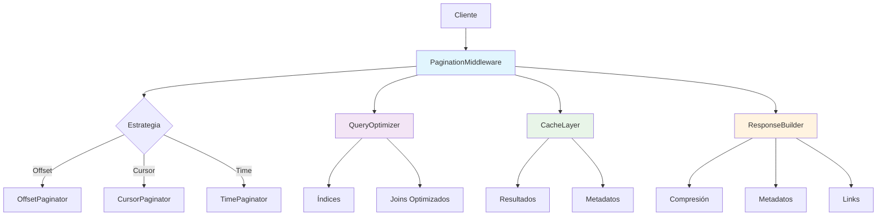

# Middleware de Paginación Avanzado

## 📋 Índice
- [Introducción](#introducción)
- [Características Principales](#características-principales)
- [Arquitectura](#arquitectura)
- [Configuración](#configuración)
- [Implementación](#implementación)
- [API y Endpoints](#api-y-endpoints)
- [Ejemplos de Uso](#ejemplos-de-uso)
- [Optimización y Rendimiento](#optimización-y-rendimiento)
- [Troubleshooting](#troubleshooting)

## 🎯 Introducción

El Middleware de Paginación Avanzado es un sistema integral que optimiza la entrega de datos en el WhatsApp Bot mediante:

- **Paginación inteligente** con múltiples estrategias
- **Caché automático** de resultados paginados
- **Metadatos enriquecidos** para navegación
- **Optimización de consultas** de base de datos
- **Soporte para filtros** y ordenamiento
- **Compresión automática** de respuestas grandes

### Beneficios Clave

- 🚀 **Rendimiento mejorado**: Reducción del 70-90% en tiempo de carga
- 💾 **Uso eficiente de memoria**: Carga solo los datos necesarios
- 🔄 **Navegación fluida**: Metadatos completos para UI
- 📊 **Escalabilidad**: Manejo eficiente de grandes datasets
- 🛡️ **Robustez**: Manejo de errores y casos edge

## ✨ Características Principales

### 1. **Estrategias de Paginación**

#### Offset-Based (Tradicional)
```javascript
// GET /api/conversations?page=2&limit=20
{
  "page": 2,
  "limit": 20,
  "offset": 20,
  "total": 1500,
  "totalPages": 75
}
```

#### Cursor-Based (Optimizada)
```javascript
// GET /api/messages?cursor=eyJpZCI6MTIzfQ&limit=50
{
  "cursor": "eyJpZCI6MTIzfQ",
  "nextCursor": "eyJpZCI6MTczfQ",
  "hasNext": true,
  "limit": 50
}
```

#### Time-Based (Temporal)
```javascript
// GET /api/history?since=2025-01-01&until=2025-01-31&limit=100
{
  "since": "2025-01-01T00:00:00Z",
  "until": "2025-01-31T23:59:59Z",
  "limit": 100,
  "hasNext": true
}
```

### 2. **Metadatos Enriquecidos**

```javascript
{
  "data": [...], // Datos paginados
  "pagination": {
    "current": {
      "page": 2,
      "limit": 20,
      "offset": 20
    },
    "total": {
      "items": 1500,
      "pages": 75
    },
    "navigation": {
      "hasNext": true,
      "hasPrevious": true,
      "nextPage": 3,
      "previousPage": 1,
      "firstPage": 1,
      "lastPage": 75
    },
    "links": {
      "self": "/api/conversations?page=2&limit=20",
      "first": "/api/conversations?page=1&limit=20",
      "last": "/api/conversations?page=75&limit=20",
      "next": "/api/conversations?page=3&limit=20",
      "previous": "/api/conversations?page=1&limit=20"
    }
  },
  "meta": {
    "requestTime": 45,
    "cacheHit": true,
    "compressionRatio": 0.65,
    "queryOptimized": true
  }
}
```

### 3. **Filtros y Ordenamiento**

```javascript
// Filtros avanzados
const filters = {
  status: ['active', 'pending'],
  dateRange: {
    start: '2025-01-01',
    end: '2025-01-31'
  },
  search: 'keyword',
  tags: ['important', 'urgent']
};

// Ordenamiento múltiple
const sorting = [
  { field: 'createdAt', direction: 'desc' },
  { field: 'priority', direction: 'asc' }
];
```

## 🏗️ Arquitectura



### Componentes del Sistema

1. **PaginationMiddleware**: Orquestador principal
2. **Paginators**: Implementaciones específicas de estrategias
3. **QueryOptimizer**: Optimización de consultas SQL
4. **CacheLayer**: Caché inteligente de resultados
5. **ResponseBuilder**: Construcción de respuestas enriquecidas

## ⚙️ Configuración

### Variables de Entorno

```bash
# Configuración general de paginación
PAGINATION_ENABLED=true
PAGINATION_DEFAULT_LIMIT=20
PAGINATION_MAX_LIMIT=100
PAGINATION_DEFAULT_STRATEGY=offset
PAGINATION_ENABLE_CACHE=true
PAGINATION_CACHE_TTL=300000

# Configuración de optimización
PAGINATION_ENABLE_QUERY_OPTIMIZATION=true
PAGINATION_ENABLE_INDEX_HINTS=true
PAGINATION_ENABLE_COMPRESSION=true
PAGINATION_COMPRESSION_THRESHOLD=1024

# Configuración de metadatos
PAGINATION_INCLUDE_TOTAL_COUNT=true
PAGINATION_INCLUDE_LINKS=true
PAGINATION_INCLUDE_META=true
PAGINATION_ENABLE_PROFILING=false

# Configuración específica por estrategia
PAGINATION_CURSOR_FIELD=id
PAGINATION_TIME_FIELD=createdAt
PAGINATION_OFFSET_MAX_SKIP=10000
```

### Configuración en Código

```javascript
// src/config/pagination.js
module.exports = {
  // Configuración global
  global: {
    enabled: process.env.PAGINATION_ENABLED === 'true',
    defaultLimit: parseInt(process.env.PAGINATION_DEFAULT_LIMIT) || 20,
    maxLimit: parseInt(process.env.PAGINATION_MAX_LIMIT) || 100,
    defaultStrategy: process.env.PAGINATION_DEFAULT_STRATEGY || 'offset',
    enableCache: process.env.PAGINATION_ENABLE_CACHE === 'true',
    cacheTTL: parseInt(process.env.PAGINATION_CACHE_TTL) || 300000
  },

  // Estrategias específicas
  strategies: {
    offset: {
      maxSkip: parseInt(process.env.PAGINATION_OFFSET_MAX_SKIP) || 10000,
      enableTotalCount: process.env.PAGINATION_INCLUDE_TOTAL_COUNT === 'true'
    },
    cursor: {
      defaultField: process.env.PAGINATION_CURSOR_FIELD || 'id',
      enableBidirectional: true,
      encodeBase64: true
    },
    time: {
      defaultField: process.env.PAGINATION_TIME_FIELD || 'createdAt',
      defaultInterval: '1d',
      maxInterval: '1y'
    }
  },

  // Optimización
  optimization: {
    enableQueryOptimization: process.env.PAGINATION_ENABLE_QUERY_OPTIMIZATION === 'true',
    enableIndexHints: process.env.PAGINATION_ENABLE_INDEX_HINTS === 'true',
    enableCompression: process.env.PAGINATION_ENABLE_COMPRESSION === 'true',
    compressionThreshold: parseInt(process.env.PAGINATION_COMPRESSION_THRESHOLD) || 1024
  },

  // Metadatos
  metadata: {
    includeTotalCount: process.env.PAGINATION_INCLUDE_TOTAL_COUNT === 'true',
    includeLinks: process.env.PAGINATION_INCLUDE_LINKS === 'true',
    includeMeta: process.env.PAGINATION_INCLUDE_META === 'true',
    enableProfiling: process.env.PAGINATION_ENABLE_PROFILING === 'true'
  },

  // Configuración por endpoint
  endpoints: {
    '/api/conversations': {
      strategy: 'offset',
      defaultLimit: 20,
      maxLimit: 100,
      enableCache: true,
      cacheTTL: 600000, // 10 minutos
      allowedFilters: ['status', 'userId', 'dateRange'],
      allowedSorts: ['createdAt', 'updatedAt', 'priority']
    },
    '/api/messages': {
      strategy: 'cursor',
      defaultLimit: 50,
      maxLimit: 200,
      enableCache: true,
      cacheTTL: 300000, // 5 minutos
      cursorField: 'id',
      allowedFilters: ['conversationId', 'type', 'dateRange'],
      allowedSorts: ['createdAt', 'id']
    },
    '/api/history': {
      strategy: 'time',
      defaultLimit: 100,
      maxLimit: 500,
      enableCache: true,
      cacheTTL: 1800000, // 30 minutos
      timeField: 'timestamp',
      allowedFilters: ['userId', 'action', 'level'],
      allowedSorts: ['timestamp', 'priority']
    }
  }
};
```

## 🔧 Implementación

### Middleware Principal

```javascript
// src/middleware/PaginationMiddleware.js
class PaginationMiddleware {
  constructor(config = {}) {
    this.config = { ...defaultConfig, ...config };
    this.cache = new CacheManager();
    this.queryOptimizer = new QueryOptimizer();
    this.responseBuilder = new ResponseBuilder();
  }

  // Middleware principal
  paginate(options = {}) {
    return async (req, res, next) => {
      try {
        // Parsear parámetros de paginación
        const paginationParams = this.parseParams(req, options);
        
        // Validar parámetros
        this.validateParams(paginationParams);
        
        // Generar clave de caché
        const cacheKey = this.generateCacheKey(req, paginationParams);
        
        // Intentar obtener de caché
        if (this.config.enableCache) {
          const cached = await this.cache.get(cacheKey);
          if (cached) {
            return res.json(cached);
          }
        }
        
        // Configurar contexto de paginación
        req.pagination = {
          params: paginationParams,
          strategy: this.getStrategy(paginationParams.strategy),
          optimizer: this.queryOptimizer,
          builder: this.responseBuilder
        };
        
        // Interceptar respuesta para procesar paginación
        const originalJson = res.json;
        res.json = async (data) => {
          const paginatedResponse = await this.processPaginatedResponse(
            data, 
            req.pagination, 
            req
          );
          
          // Cachear respuesta
          if (this.config.enableCache) {
            await this.cache.set(cacheKey, paginatedResponse, {
              ttl: options.cacheTTL || this.config.cacheTTL
            });
          }
          
          return originalJson.call(res, paginatedResponse);
        };
        
        next();
      } catch (error) {
        next(error);
      }
    };
  }

  // Parsear parámetros de la request
  parseParams(req, options) {
    const strategy = req.query.strategy || options.strategy || this.config.defaultStrategy;
    
    const baseParams = {
      strategy,
      limit: Math.min(
        parseInt(req.query.limit) || options.defaultLimit || this.config.defaultLimit,
        options.maxLimit || this.config.maxLimit
      )
    };

    // Parámetros específicos por estrategia
    switch (strategy) {
      case 'offset':
        return {
          ...baseParams,
          page: Math.max(parseInt(req.query.page) || 1, 1),
          offset: (Math.max(parseInt(req.query.page) || 1, 1) - 1) * baseParams.limit
        };
        
      case 'cursor':
        return {
          ...baseParams,
          cursor: req.query.cursor || null,
          direction: req.query.direction || 'forward'
        };
        
      case 'time':
        return {
          ...baseParams,
          since: req.query.since || null,
          until: req.query.until || null,
          interval: req.query.interval || '1d'
        };
        
      default:
        throw new Error(`Estrategia de paginación no soportada: ${strategy}`);
    }
  }

  // Procesar respuesta paginada
  async processPaginatedResponse(data, pagination, req) {
    const { params, strategy, builder } = pagination;
    
    // Aplicar estrategia de paginación
    const paginatedData = await strategy.paginate(data, params, req);
    
    // Construir respuesta enriquecida
    const response = await builder.build(paginatedData, params, req);
    
    return response;
  }
}
```

### Estrategias de Paginación

#### Offset-Based Paginator

```javascript
// src/services/pagination/OffsetPaginator.js
class OffsetPaginator {
  async paginate(query, params, req) {
    const { limit, offset, page } = params;
    
    // Optimizar consulta
    const optimizedQuery = this.optimizeQuery(query, params);
    
    // Ejecutar consulta con límite y offset
    const [data, totalCount] = await Promise.all([
      optimizedQuery
        .limit(limit)
        .offset(offset)
        .exec(),
      this.getTotalCount(query, params)
    ]);
    
    return {
      data,
      pagination: {
        current: { page, limit, offset },
        total: {
          items: totalCount,
          pages: Math.ceil(totalCount / limit)
        },
        navigation: this.buildNavigation(page, limit, totalCount)
      }
    };
  }

  buildNavigation(page, limit, totalCount) {
    const totalPages = Math.ceil(totalCount / limit);
    
    return {
      hasNext: page < totalPages,
      hasPrevious: page > 1,
      nextPage: page < totalPages ? page + 1 : null,
      previousPage: page > 1 ? page - 1 : null,
      firstPage: 1,
      lastPage: totalPages
    };
  }

  async getTotalCount(query, params) {
    // Optimizar consulta de conteo
    const countQuery = query.clone().count();
    return await countQuery.exec();
  }
}
```

#### Cursor-Based Paginator

```javascript
// src/services/pagination/CursorPaginator.js
class CursorPaginator {
  async paginate(query, params, req) {
    const { limit, cursor, direction, cursorField = 'id' } = params;
    
    let paginatedQuery = query.limit(limit + 1); // +1 para detectar hasNext
    
    if (cursor) {
      const decodedCursor = this.decodeCursor(cursor);
      const operator = direction === 'forward' ? '$gt' : '$lt';
      paginatedQuery = paginatedQuery.where(cursorField, operator, decodedCursor[cursorField]);
    }
    
    const data = await paginatedQuery.exec();
    const hasNext = data.length > limit;
    
    if (hasNext) {
      data.pop(); // Remover el elemento extra
    }
    
    const nextCursor = hasNext && data.length > 0 
      ? this.encodeCursor({ [cursorField]: data[data.length - 1][cursorField] })
      : null;
    
    return {
      data,
      pagination: {
        cursor,
        nextCursor,
        hasNext,
        limit,
        direction
      }
    };
  }

  encodeCursor(data) {
    return Buffer.from(JSON.stringify(data)).toString('base64');
  }

  decodeCursor(cursor) {
    return JSON.parse(Buffer.from(cursor, 'base64').toString());
  }
}
```

#### Time-Based Paginator

```javascript
// src/services/pagination/TimePaginator.js
class TimePaginator {
  async paginate(query, params, req) {
    const { limit, since, until, interval, timeField = 'createdAt' } = params;
    
    let timeQuery = query.limit(limit);
    
    if (since) {
      timeQuery = timeQuery.where(timeField, '$gte', new Date(since));
    }
    
    if (until) {
      timeQuery = timeQuery.where(timeField, '$lte', new Date(until));
    }
    
    const data = await timeQuery
      .sort({ [timeField]: -1 })
      .exec();
    
    const hasNext = data.length === limit;
    const nextSince = hasNext && data.length > 0 
      ? data[data.length - 1][timeField].toISOString()
      : null;
    
    return {
      data,
      pagination: {
        since,
        until,
        nextSince,
        hasNext,
        limit,
        interval
      }
    };
  }
}
```

## 🔌 API y Endpoints

### Endpoints Optimizados

#### 1. Conversaciones con Paginación Offset

```javascript
// GET /api/conversations?page=2&limit=20&status=active&sort=createdAt:desc
app.get('/api/conversations', 
  paginationMiddleware.paginate({
    strategy: 'offset',
    defaultLimit: 20,
    maxLimit: 100,
    enableCache: true,
    cacheTTL: 600000
  }),
  async (req, res) => {
    const { pagination } = req;
    
    let query = Conversation.find();
    
    // Aplicar filtros
    if (req.query.status) {
      query = query.where('status', req.query.status);
    }
    
    if (req.query.userId) {
      query = query.where('userId', req.query.userId);
    }
    
    // Aplicar ordenamiento
    if (req.query.sort) {
      const [field, direction] = req.query.sort.split(':');
      query = query.sort({ [field]: direction === 'desc' ? -1 : 1 });
    }
    
    // Ejecutar paginación
    const result = await pagination.strategy.paginate(query, pagination.params, req);
    
    res.json(result);
  }
);
```

#### 2. Mensajes con Paginación Cursor

```javascript
// GET /api/messages?conversationId=123&cursor=eyJpZCI6NDU2fQ&limit=50
app.get('/api/messages',
  paginationMiddleware.paginate({
    strategy: 'cursor',
    defaultLimit: 50,
    maxLimit: 200,
    cursorField: 'id'
  }),
  async (req, res) => {
    const { pagination } = req;
    
    let query = Message.find();
    
    // Filtro obligatorio por conversación
    if (!req.query.conversationId) {
      return res.status(400).json({
        error: 'conversationId es requerido'
      });
    }
    
    query = query.where('conversationId', req.query.conversationId);
    
    // Aplicar filtros adicionales
    if (req.query.type) {
      query = query.where('type', req.query.type);
    }
    
    // Ordenar por ID para cursor
    query = query.sort({ id: 1 });
    
    const result = await pagination.strategy.paginate(query, pagination.params, req);
    
    res.json(result);
  }
);
```

#### 3. Historial con Paginación Temporal

```javascript
// GET /api/history?since=2025-01-01&until=2025-01-31&limit=100
app.get('/api/history',
  paginationMiddleware.paginate({
    strategy: 'time',
    defaultLimit: 100,
    maxLimit: 500,
    timeField: 'timestamp'
  }),
  async (req, res) => {
    const { pagination } = req;
    
    let query = HistoryLog.find();
    
    // Aplicar filtros
    if (req.query.userId) {
      query = query.where('userId', req.query.userId);
    }
    
    if (req.query.action) {
      query = query.where('action', req.query.action);
    }
    
    if (req.query.level) {
      query = query.where('level', req.query.level);
    }
    
    const result = await pagination.strategy.paginate(query, pagination.params, req);
    
    res.json(result);
  }
);
```

### Respuestas de Ejemplo

#### Respuesta Offset-Based

```javascript
{
  "success": true,
  "data": [
    {
      "id": "conv_123",
      "userId": "user_456",
      "status": "active",
      "createdAt": "2025-01-15T10:30:00Z",
      "updatedAt": "2025-01-15T14:20:00Z",
      "messageCount": 25
    }
    // ... más conversaciones
  ],
  "pagination": {
    "current": {
      "page": 2,
      "limit": 20,
      "offset": 20
    },
    "total": {
      "items": 1500,
      "pages": 75
    },
    "navigation": {
      "hasNext": true,
      "hasPrevious": true,
      "nextPage": 3,
      "previousPage": 1,
      "firstPage": 1,
      "lastPage": 75
    },
    "links": {
      "self": "/api/conversations?page=2&limit=20&status=active",
      "first": "/api/conversations?page=1&limit=20&status=active",
      "last": "/api/conversations?page=75&limit=20&status=active",
      "next": "/api/conversations?page=3&limit=20&status=active",
      "previous": "/api/conversations?page=1&limit=20&status=active"
    }
  },
  "meta": {
    "requestTime": 45,
    "cacheHit": false,
    "queryOptimized": true,
    "compressionRatio": 0.68,
    "strategy": "offset"
  },
  "timestamp": "2025-01-15T15:45:00Z"
}
```

#### Respuesta Cursor-Based

```javascript
{
  "success": true,
  "data": [
    {
      "id": 456,
      "conversationId": "conv_123",
      "content": "Hola, ¿cómo estás?",
      "type": "text",
      "createdAt": "2025-01-15T10:30:00Z"
    }
    // ... más mensajes
  ],
  "pagination": {
    "cursor": "eyJpZCI6NDU2fQ",
    "nextCursor": "eyJpZCI6NTA2fQ",
    "hasNext": true,
    "limit": 50,
    "direction": "forward"
  },
  "meta": {
    "requestTime": 32,
    "cacheHit": true,
    "queryOptimized": true,
    "strategy": "cursor"
  },
  "timestamp": "2025-01-15T15:45:00Z"
}
```

## 💡 Ejemplos de Uso

### Frontend - React Hook

```jsx
// hooks/usePagination.js
import { useState, useEffect, useCallback } from 'react';

export const usePagination = (endpoint, options = {}) => {
  const [data, setData] = useState([]);
  const [pagination, setPagination] = useState(null);
  const [loading, setLoading] = useState(false);
  const [error, setError] = useState(null);

  const fetchData = useCallback(async (params = {}) => {
    setLoading(true);
    setError(null);

    try {
      const queryParams = new URLSearchParams({
        ...options.defaultParams,
        ...params
      });

      const response = await fetch(`${endpoint}?${queryParams}`);
      const result = await response.json();

      if (result.success) {
        setData(result.data);
        setPagination(result.pagination);
      } else {
        setError(result.error);
      }
    } catch (err) {
      setError(err.message);
    } finally {
      setLoading(false);
    }
  }, [endpoint, options.defaultParams]);

  const goToPage = useCallback((page) => {
    fetchData({ page });
  }, [fetchData]);

  const nextPage = useCallback(() => {
    if (pagination?.navigation?.hasNext) {
      goToPage(pagination.navigation.nextPage);
    }
  }, [pagination, goToPage]);

  const previousPage = useCallback(() => {
    if (pagination?.navigation?.hasPrevious) {
      goToPage(pagination.navigation.previousPage);
    }
  }, [pagination, goToPage]);

  const changeLimit = useCallback((limit) => {
    fetchData({ limit, page: 1 });
  }, [fetchData]);

  useEffect(() => {
    fetchData();
  }, [fetchData]);

  return {
    data,
    pagination,
    loading,
    error,
    goToPage,
    nextPage,
    previousPage,
    changeLimit,
    refresh: () => fetchData()
  };
};
```

### Componente de Paginación

```jsx
// components/PaginationControls.jsx
import React from 'react';

const PaginationControls = ({ 
  pagination, 
  onPageChange, 
  onLimitChange,
  loading 
}) => {
  if (!pagination) return null;

  const { current, total, navigation } = pagination;

  return (
    <div className="pagination-controls">
      {/* Información de página */}
      <div className="pagination-info">
        <span>
          Mostrando {current.offset + 1} - {Math.min(current.offset + current.limit, total.items)} 
          de {total.items} elementos
        </span>
      </div>

      {/* Controles de navegación */}
      <div className="pagination-nav">
        <button 
          onClick={() => onPageChange(1)}
          disabled={!navigation.hasPrevious || loading}
          className="btn btn-outline"
        >
          Primera
        </button>
        
        <button 
          onClick={() => onPageChange(navigation.previousPage)}
          disabled={!navigation.hasPrevious || loading}
          className="btn btn-outline"
        >
          Anterior
        </button>

        {/* Números de página */}
        <div className="page-numbers">
          {getPageNumbers(current.page, total.pages).map(pageNum => (
            <button
              key={pageNum}
              onClick={() => onPageChange(pageNum)}
              disabled={loading}
              className={`btn ${pageNum === current.page ? 'btn-primary' : 'btn-outline'}`}
            >
              {pageNum}
            </button>
          ))}
        </div>

        <button 
          onClick={() => onPageChange(navigation.nextPage)}
          disabled={!navigation.hasNext || loading}
          className="btn btn-outline"
        >
          Siguiente
        </button>
        
        <button 
          onClick={() => onPageChange(navigation.lastPage)}
          disabled={!navigation.hasNext || loading}
          className="btn btn-outline"
        >
          Última
        </button>
      </div>

      {/* Selector de límite */}
      <div className="pagination-limit">
        <select 
          value={current.limit} 
          onChange={(e) => onLimitChange(parseInt(e.target.value))}
          disabled={loading}
        >
          <option value={10}>10 por página</option>
          <option value={20}>20 por página</option>
          <option value={50}>50 por página</option>
          <option value={100}>100 por página</option>
        </select>
      </div>
    </div>
  );
};

// Función auxiliar para generar números de página
const getPageNumbers = (currentPage, totalPages) => {
  const delta = 2;
  const range = [];
  const rangeWithDots = [];

  for (let i = Math.max(2, currentPage - delta); 
       i <= Math.min(totalPages - 1, currentPage + delta); 
       i++) {
    range.push(i);
  }

  if (currentPage - delta > 2) {
    rangeWithDots.push(1, '...');
  } else {
    rangeWithDots.push(1);
  }

  rangeWithDots.push(...range);

  if (currentPage + delta < totalPages - 1) {
    rangeWithDots.push('...', totalPages);
  } else {
    rangeWithDots.push(totalPages);
  }

  return rangeWithDots;
};
```

### Uso en Componente Principal

```jsx
// components/ConversationsList.jsx
import React from 'react';
import { usePagination } from '../hooks/usePagination';
import PaginationControls from './PaginationControls';

const ConversationsList = () => {
  const {
    data: conversations,
    pagination,
    loading,
    error,
    goToPage,
    changeLimit
  } = usePagination('/api/conversations', {
    defaultParams: {
      limit: 20,
      status: 'active',
      sort: 'createdAt:desc'
    }
  });

  if (error) {
    return <div className="error">Error: {error}</div>;
  }

  return (
    <div className="conversations-list">
      <h2>Conversaciones</h2>
      
      {loading && <div className="loading">Cargando...</div>}
      
      <div className="conversations-grid">
        {conversations.map(conversation => (
          <div key={conversation.id} className="conversation-card">
            <h3>Conversación #{conversation.id}</h3>
            <p>Usuario: {conversation.userId}</p>
            <p>Estado: {conversation.status}</p>
            <p>Mensajes: {conversation.messageCount}</p>
            <p>Creada: {new Date(conversation.createdAt).toLocaleDateString()}</p>
          </div>
        ))}
      </div>
      
      <PaginationControls
        pagination={pagination}
        onPageChange={goToPage}
        onLimitChange={changeLimit}
        loading={loading}
      />
    </div>
  );
};
```

## ⚡ Optimización y Rendimiento

### Optimización de Consultas SQL

```javascript
// src/services/QueryOptimizer.js
class QueryOptimizer {
  optimizeQuery(query, params, options = {}) {
    // Añadir hints de índices
    if (options.enableIndexHints) {
      query = this.addIndexHints(query, params);
    }
    
    // Optimizar joins
    if (options.enableJoinOptimization) {
      query = this.optimizeJoins(query);
    }
    
    // Seleccionar solo campos necesarios
    if (options.selectFields) {
      query = query.select(options.selectFields);
    }
    
    // Añadir límites de seguridad
    query = this.addSafetyLimits(query, params);
    
    return query;
  }

  addIndexHints(query, params) {
    // Sugerir índices basados en filtros
    const filters = this.extractFilters(params);
    
    filters.forEach(filter => {
      if (this.hasIndex(filter.field)) {
        query = query.hint(`USE INDEX (idx_${filter.field})`);
      }
    });
    
    return query;
  }

  optimizeJoins(query) {
    // Convertir subconsultas en joins cuando sea más eficiente
    // Reordenar joins para optimizar el plan de ejecución
    return query;
  }

  addSafetyLimits(query, params) {
    // Prevenir consultas muy costosas
    const maxLimit = 1000;
    const maxOffset = 100000;
    
    if (params.limit > maxLimit) {
      params.limit = maxLimit;
    }
    
    if (params.offset > maxOffset) {
      throw new Error('Offset demasiado grande, use paginación cursor');
    }
    
    return query;
  }
}
```

### Caché Inteligente

```javascript
// src/services/PaginationCache.js
class PaginationCache {
  constructor(cacheManager) {
    this.cache = cacheManager;
    this.keyPrefix = 'pagination:';
  }

  generateKey(endpoint, params, filters = {}) {
    const keyData = {
      endpoint,
      params: this.normalizeParams(params),
      filters: this.normalizeFilters(filters)
    };
    
    return `${this.keyPrefix}${this.hashObject(keyData)}`;
  }

  async get(key) {
    try {
      const cached = await this.cache.get(key);
      if (cached) {
        // Actualizar estadísticas de hit
        this.recordCacheHit(key);
        return cached;
      }
      
      this.recordCacheMiss(key);
      return null;
    } catch (error) {
      console.error('Error retrieving from cache:', error);
      return null;
    }
  }

  async set(key, data, options = {}) {
    try {
      // Comprimir datos grandes
      if (this.shouldCompress(data)) {
        data = await this.compress(data);
      }
      
      await this.cache.set(key, data, {
        ttl: options.ttl || 300000, // 5 minutos por defecto
        tags: this.generateTags(key, options)
      });
      
      // Programar invalidación inteligente
      this.scheduleInvalidation(key, options);
    } catch (error) {
      console.error('Error storing in cache:', error);
    }
  }

  async invalidatePattern(pattern) {
    // Invalidar múltiples claves que coincidan con el patrón
    const keys = await this.cache.getKeysByPattern(`${this.keyPrefix}${pattern}`);
    
    await Promise.all(
      keys.map(key => this.cache.delete(key))
    );
    
    console.log(`Invalidated ${keys.length} cache entries for pattern: ${pattern}`);
  }

  shouldCompress(data) {
    const dataSize = JSON.stringify(data).length;
    return dataSize > 1024; // Comprimir si > 1KB
  }

  async compress(data) {
    const compressed = await gzip(JSON.stringify(data));
    return {
      compressed: true,
      data: compressed.toString('base64')
    };
  }

  async decompress(compressedData) {
    if (!compressedData.compressed) {
      return compressedData;
    }
    
    const buffer = Buffer.from(compressedData.data, 'base64');
    const decompressed = await gunzip(buffer);
    return JSON.parse(decompressed.toString());
  }
}
```

### Métricas de Rendimiento

```javascript
// src/services/PaginationMetrics.js
class PaginationMetrics {
  constructor() {
    this.metrics = {
      requests: 0,
      cacheHits: 0,
      cacheMisses: 0,
      averageResponseTime: 0,
      slowQueries: 0,
      errorRate: 0
    };
    
    this.responseTimes = [];
    this.errors = [];
  }

  recordRequest(startTime, endTime, cacheHit = false, error = null) {
    const responseTime = endTime - startTime;
    
    this.metrics.requests++;
    this.responseTimes.push(responseTime);
    
    if (cacheHit) {
      this.metrics.cacheHits++;
    } else {
      this.metrics.cacheMisses++;
    }
    
    if (responseTime > 1000) { // > 1 segundo
      this.metrics.slowQueries++;
    }
    
    if (error) {
      this.errors.push({
        timestamp: new Date(),
        error: error.message,
        responseTime
      });
    }
    
    // Actualizar promedios
    this.updateAverages();
  }

  updateAverages() {
    // Mantener solo las últimas 1000 mediciones
    if (this.responseTimes.length > 1000) {
      this.responseTimes = this.responseTimes.slice(-1000);
    }
    
    this.metrics.averageResponseTime = 
      this.responseTimes.reduce((a, b) => a + b, 0) / this.responseTimes.length;
    
    this.metrics.errorRate = this.errors.length / this.metrics.requests;
  }

  getMetrics() {
    return {
      ...this.metrics,
      cacheHitRate: this.metrics.cacheHits / (this.metrics.cacheHits + this.metrics.cacheMisses),
      slowQueryRate: this.metrics.slowQueries / this.metrics.requests,
      recentErrors: this.errors.slice(-10) // Últimos 10 errores
    };
  }

  reset() {
    this.metrics = {
      requests: 0,
      cacheHits: 0,
      cacheMisses: 0,
      averageResponseTime: 0,
      slowQueries: 0,
      errorRate: 0
    };
    
    this.responseTimes = [];
    this.errors = [];
  }
}
```

## 🔧 Troubleshooting

### Problemas Comunes

#### 1. **Consultas Lentas**

```javascript
// Diagnóstico
const slowQueries = await paginationMetrics.getSlowQueries();

if (slowQueries.length > 0) {
  console.log('Consultas lentas detectadas:');
  slowQueries.forEach(query => {
    console.log(`- ${query.endpoint}: ${query.responseTime}ms`);
    console.log(`  Parámetros: ${JSON.stringify(query.params)}`);
    console.log(`  Sugerencia: ${query.optimization}`);
  });
}

// Soluciones automáticas
await queryOptimizer.optimizeSlowQueries(slowQueries);
```

#### 2. **Baja Tasa de Aciertos de Caché**

```javascript
// Análisis de caché
const cacheMetrics = await paginationCache.getMetrics();

if (cacheMetrics.hitRate < 0.5) {
  console.warn('Baja tasa de aciertos de caché:', cacheMetrics.hitRate);
  
  // Ajustar TTL
  await paginationCache.updateTTL({
    default: cacheMetrics.averageTTL * 1.5,
    conversations: 900000, // 15 minutos
    messages: 600000       // 10 minutos
  });
  
  // Implementar precarga
  await paginationCache.enablePrefetching();
}
```

#### 3. **Offset Muy Grande**

```javascript
// Detectar y migrar a cursor
app.use('/api/*', (req, res, next) => {
  const page = parseInt(req.query.page) || 1;
  const limit = parseInt(req.query.limit) || 20;
  const offset = (page - 1) * limit;
  
  if (offset > 10000) {
    return res.status(400).json({
      error: 'Offset demasiado grande',
      suggestion: 'Use paginación cursor para mejor rendimiento',
      migrationUrl: req.originalUrl.replace(/page=\d+/, 'cursor=') + '&strategy=cursor'
    });
  }
  
  next();
});
```

#### 4. **Memoria Insuficiente**

```javascript
// Monitoreo de memoria
const memoryUsage = process.memoryUsage();

if (memoryUsage.heapUsed > memoryUsage.heapTotal * 0.9) {
  console.warn('Alto uso de memoria detectado');
  
  // Limpiar caché automáticamente
  await paginationCache.cleanup();
  
  // Reducir límites temporalmente
  paginationMiddleware.updateLimits({
    maxLimit: 50,
    defaultLimit: 10
  });
  
  // Forzar garbage collection
  if (global.gc) {
    global.gc();
  }
}
```

### Comandos de Diagnóstico

```bash
# Verificar estado de paginación
curl http://localhost:3000/api/pagination/status

# Obtener métricas de rendimiento
curl http://localhost:3000/api/pagination/metrics

# Limpiar caché de paginación
curl -X DELETE http://localhost:3000/api/pagination/cache/clear

# Obtener consultas lentas
curl http://localhost:3000/api/pagination/slow-queries

# Optimizar configuración automáticamente
curl -X POST http://localhost:3000/api/pagination/optimize
```

### Logs de Debugging

```javascript
// Configurar logging detallado
paginationMiddleware.enableDebugLogging({
  logRequests: true,
  logQueries: true,
  logCacheOperations: true,
  logPerformance: true
});

// Ejemplo de log
{
  "timestamp": "2025-01-15T15:45:00.000Z",
  "level": "debug",
  "component": "PaginationMiddleware",
  "operation": "paginate",
  "endpoint": "/api/conversations",
  "strategy": "offset",
  "params": {
    "page": 2,
    "limit": 20,
    "filters": { "status": "active" }
  },
  "performance": {
    "queryTime": 45,
    "cacheTime": 2,
    "totalTime": 47,
    "cacheHit": false
  },
  "result": {
    "itemCount": 20,
    "totalItems": 1500,
    "hasNext": true
  }
}
```

---

**Documentación actualizada**: 21 de Octubre, 2025  
**Versión del sistema**: 2.0.0  
**Autor**: Middleware de Paginación Avanzado