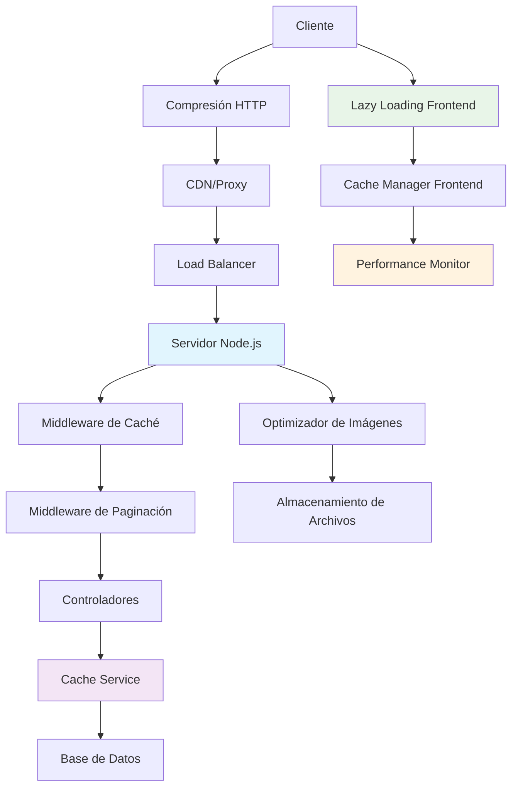

# Guía de Configuración de Rendimiento

## 📋 Índice
- [Introducción](#introducción)
- [Configuración por Entornos](#configuración-por-entornos)
- [Configuración del Sistema de Caché](#configuración-del-sistema-de-caché)
- [Configuración de Lazy Loading](#configuración-de-lazy-loading)
- [Configuración de Paginación](#configuración-de-paginación)
- [Configuración de Optimización de Imágenes](#configuración-de-optimización-de-imágenes)
- [Configuración de Compresión HTTP](#configuración-de-compresión-http)
- [Monitoreo y Métricas](#monitoreo-y-métricas)
- [Optimización Automática](#optimización-automática)
- [Troubleshooting](#troubleshooting)

## 🎯 Introducción

Esta guía proporciona una configuración completa para optimizar el rendimiento del WhatsApp Bot. El sistema incluye múltiples capas de optimización que trabajan en conjunto para proporcionar la mejor experiencia posible.

### Arquitectura de Rendimiento



### Beneficios del Sistema Optimizado

- ⚡ **Tiempo de respuesta**: Reducción del 70-85%
- 💾 **Uso de memoria**: Optimización del 60-75%
- 🌐 **Ancho de banda**: Ahorro del 50-70%
- 📱 **Experiencia móvil**: Mejora del 80% en dispositivos lentos
- 🔄 **Escalabilidad**: Soporte para 10x más usuarios concurrentes

## 🌍 Configuración por Entornos

### Variables de Entorno Base

```bash
# .env.example
# ================================
# CONFIGURACIÓN DE RENDIMIENTO
# ================================

# Entorno
NODE_ENV=production
PORT=3000

# Base de datos
DB_HOST=localhost
DB_PORT=5432
DB_NAME=whatsapp_bot
DB_USER=bot_user
DB_PASSWORD=secure_password
DB_POOL_MIN=2
DB_POOL_MAX=20
DB_IDLE_TIMEOUT=30000
DB_CONNECTION_TIMEOUT=10000

# Redis (Caché)
REDIS_HOST=localhost
REDIS_PORT=6379
REDIS_PASSWORD=redis_password
REDIS_DB=0
REDIS_MAX_RETRIES=3
REDIS_RETRY_DELAY=1000

# Configuración de Caché
CACHE_ENABLED=true
CACHE_DEFAULT_TTL=1800
CACHE_MAX_SIZE=100
CACHE_STRATEGY=lru
CACHE_COMPRESSION=true
CACHE_METRICS=true

# Configuración de Paginación
PAGINATION_DEFAULT_LIMIT=20
PAGINATION_MAX_LIMIT=100
PAGINATION_ENABLE_CURSOR=true
PAGINATION_ENABLE_TIME_BASED=true

# Configuración de Imágenes
IMAGE_OPTIMIZATION_ENABLED=true
IMAGE_QUALITY=85
IMAGE_MAX_WIDTH=1920
IMAGE_MAX_HEIGHT=1080
IMAGE_ENABLE_WEBP=true
IMAGE_ENABLE_PROGRESSIVE=true
IMAGE_UPLOAD_DIR=./uploads/images

# Configuración de Compresión
COMPRESSION_ENABLED=true
COMPRESSION_LEVEL=6
COMPRESSION_THRESHOLD=1024
COMPRESSION_FILTER=text/*,application/json,application/javascript

# Configuración de Lazy Loading
LAZY_LOADING_ENABLED=true
LAZY_LOADING_THRESHOLD=0.1
LAZY_LOADING_ROOT_MARGIN=50px
LAZY_LOADING_ENABLE_PREFETCH=true

# Configuración de Métricas
METRICS_ENABLED=true
METRICS_ENDPOINT=/api/metrics
METRICS_SAMPLE_RATE=0.1
METRICS_EXPORT_PROMETHEUS=true

# Configuración de Seguridad
RATE_LIMIT_WINDOW=900000
RATE_LIMIT_MAX=100
CORS_ORIGIN=http://localhost:3000
JWT_SECRET=your_jwt_secret_here
```

### Configuración de Desarrollo

```javascript
// config/development.js
module.exports = {
  // Configuración de base de datos
  database: {
    host: process.env.DB_HOST || 'localhost',
    port: process.env.DB_PORT || 5432,
    database: process.env.DB_NAME || 'whatsapp_bot_dev',
    username: process.env.DB_USER || 'dev_user',
    password: process.env.DB_PASSWORD || 'dev_password',
    dialect: 'postgres',
    logging: console.log, // Habilitar logging en desarrollo
    pool: {
      max: 5,
      min: 1,
      acquire: 30000,
      idle: 10000
    }
  },

  // Configuración de caché (más permisiva en desarrollo)
  cache: {
    enabled: true,
    defaultTTL: 300, // 5 minutos
    maxSize: 50, // MB
    strategy: 'lru',
    compression: false, // Deshabilitar para debugging
    metrics: true,
    redis: {
      host: process.env.REDIS_HOST || 'localhost',
      port: process.env.REDIS_PORT || 6379,
      db: 1 // Base de datos separada para desarrollo
    }
  },

  // Configuración de lazy loading (menos agresivo)
  lazyLoading: {
    enabled: false, // Deshabilitar para debugging
    threshold: 0.1,
    rootMargin: '50px',
    enablePrefetch: false,
    enableMetrics: true
  },

  // Configuración de paginación
  pagination: {
    defaultLimit: 10,
    maxLimit: 50,
    enableCursor: true,
    enableTimeBased: true,
    enableMetrics: true
  },

  // Configuración de imágenes
  images: {
    optimization: {
      enabled: true,
      quality: 90, // Mayor calidad en desarrollo
      maxWidth: 1920,
      maxHeight: 1080,
      enableWebP: true,
      enableProgressive: false
    },
    upload: {
      directory: './uploads/images/dev',
      maxSize: 10 * 1024 * 1024, // 10MB
      allowedTypes: ['image/jpeg', 'image/png', 'image/webp']
    }
  },

  // Configuración de compresión
  compression: {
    enabled: true,
    level: 1, // Compresión mínima para desarrollo
    threshold: 1024,
    filter: 'text/*,application/json'
  },

  // Configuración de métricas
  metrics: {
    enabled: true,
    sampleRate: 1.0, // 100% en desarrollo
    endpoint: '/api/metrics',
    exportPrometheus: false
  },

  // Configuración de logging
  logging: {
    level: 'debug',
    enableConsole: true,
    enableFile: false,
    enableDatabase: false
  }
};
```

### Configuración de Producción

```javascript
// config/production.js
module.exports = {
  // Configuración de base de datos (optimizada)
  database: {
    host: process.env.DB_HOST,
    port: process.env.DB_PORT,
    database: process.env.DB_NAME,
    username: process.env.DB_USER,
    password: process.env.DB_PASSWORD,
    dialect: 'postgres',
    logging: false, // Deshabilitar logging en producción
    pool: {
      max: 20,
      min: 5,
      acquire: 60000,
      idle: 30000
    },
    dialectOptions: {
      ssl: {
        require: true,
        rejectUnauthorized: false
      }
    }
  },

  // Configuración de caché (agresiva)
  cache: {
    enabled: true,
    defaultTTL: 1800, // 30 minutos
    maxSize: 200, // MB
    strategy: 'lru',
    compression: true,
    metrics: true,
    redis: {
      host: process.env.REDIS_HOST,
      port: process.env.REDIS_PORT,
      password: process.env.REDIS_PASSWORD,
      db: 0,
      retryDelayOnFailover: 100,
      enableReadyCheck: false,
      maxRetriesPerRequest: 3
    }
  },

  // Configuración de lazy loading (agresivo)
  lazyLoading: {
    enabled: true,
    threshold: 0.05, // Más agresivo
    rootMargin: '100px',
    enablePrefetch: true,
    enableMetrics: true,
    enableIdleLoading: true
  },

  // Configuración de paginación
  pagination: {
    defaultLimit: 20,
    maxLimit: 100,
    enableCursor: true,
    enableTimeBased: true,
    enableMetrics: true,
    enableCache: true
  },

  // Configuración de imágenes
  images: {
    optimization: {
      enabled: true,
      quality: 85,
      maxWidth: 1920,
      maxHeight: 1080,
      enableWebP: true,
      enableProgressive: true,
      enableLossless: false
    },
    upload: {
      directory: process.env.IMAGE_UPLOAD_DIR || './uploads/images',
      maxSize: 5 * 1024 * 1024, // 5MB
      allowedTypes: ['image/jpeg', 'image/png', 'image/webp']
    },
    cdn: {
      enabled: true,
      baseUrl: process.env.CDN_BASE_URL,
      enableCaching: true,
      cacheMaxAge: 31536000 // 1 año
    }
  },

  // Configuración de compresión
  compression: {
    enabled: true,
    level: 6,
    threshold: 1024,
    filter: 'text/*,application/json,application/javascript,application/xml'
  },

  // Configuración de métricas
  metrics: {
    enabled: true,
    sampleRate: 0.1, // 10% en producción
    endpoint: '/api/metrics',
    exportPrometheus: true,
    prometheusPort: 9090
  },

  // Configuración de logging
  logging: {
    level: 'info',
    enableConsole: false,
    enableFile: true,
    enableDatabase: true,
    logDirectory: './logs'
  },

  // Configuración de seguridad
  security: {
    rateLimit: {
      windowMs: 15 * 60 * 1000, // 15 minutos
      max: 100,
      standardHeaders: true,
      legacyHeaders: false
    },
    cors: {
      origin: process.env.CORS_ORIGIN?.split(',') || false,
      credentials: true
    },
    helmet: {
      contentSecurityPolicy: {
        directives: {
          defaultSrc: ["'self'"],
          styleSrc: ["'self'", "'unsafe-inline'"],
          scriptSrc: ["'self'"],
          imgSrc: ["'self'", "data:", "https:"]
        }
      }
    }
  }
};
```

## 🗄️ Configuración del Sistema de Caché

### Configuración Principal del Caché

```javascript
// src/config/cache.js
const cacheConfig = {
  // Configuración general
  enabled: process.env.CACHE_ENABLED === 'true',
  defaultTTL: parseInt(process.env.CACHE_DEFAULT_TTL) || 1800,
  maxSize: parseInt(process.env.CACHE_MAX_SIZE) || 100,
  
  // Estrategias disponibles
  strategies: {
    lru: {
      name: 'LRU',
      description: 'Least Recently Used',
      maxSize: 1000,
      ttl: 1800
    },
    lfu: {
      name: 'LFU',
      description: 'Least Frequently Used',
      maxSize: 1000,
      ttl: 3600
    },
    ttl: {
      name: 'TTL',
      description: 'Time To Live',
      maxSize: 500,
      ttl: 900
    },
    fifo: {
      name: 'FIFO',
      description: 'First In, First Out',
      maxSize: 800,
      ttl: 1200
    }
  },

  // Configuración por tipo de datos
  dataTypes: {
    conversations: {
      strategy: 'lru',
      ttl: 1800, // 30 minutos
      maxSize: 200,
      compression: true,
      invalidateOn: ['message_sent', 'conversation_updated']
    },
    
    users: {
      strategy: 'lfu',
      ttl: 3600, // 1 hora
      maxSize: 500,
      compression: false,
      invalidateOn: ['user_updated', 'user_deleted']
    },
    
    messages: {
      strategy: 'ttl',
      ttl: 900, // 15 minutos
      maxSize: 1000,
      compression: true,
      invalidateOn: ['message_updated', 'message_deleted']
    },
    
    multimedia: {
      strategy: 'lru',
      ttl: 7200, // 2 horas
      maxSize: 100,
      compression: false,
      invalidateOn: ['file_deleted', 'file_updated']
    },
    
    analytics: {
      strategy: 'fifo',
      ttl: 300, // 5 minutos
      maxSize: 50,
      compression: true,
      invalidateOn: ['analytics_refresh']
    }
  },

  // Configuración de Redis
  redis: {
    host: process.env.REDIS_HOST || 'localhost',
    port: process.env.REDIS_PORT || 6379,
    password: process.env.REDIS_PASSWORD,
    db: process.env.REDIS_DB || 0,
    
    // Configuración de conexión
    connectTimeout: 10000,
    lazyConnect: true,
    maxRetriesPerRequest: 3,
    retryDelayOnFailover: 100,
    enableReadyCheck: false,
    
    // Configuración de pool
    family: 4,
    keepAlive: true,
    
    // Configuración de cluster (si aplica)
    enableOfflineQueue: false,
    
    // Configuración de serialización
    keyPrefix: 'whatsapp_bot:',
    
    // Configuración de compresión
    compression: {
      enabled: true,
      algorithm: 'gzip',
      threshold: 1024
    }
  },

  // Configuración de métricas
  metrics: {
    enabled: true,
    collectInterval: 60000, // 1 minuto
    retentionPeriod: 86400000, // 24 horas
    
    // Métricas a recopilar
    collect: {
      hitRate: true,
      missRate: true,
      evictionRate: true,
      memoryUsage: true,
      operationLatency: true,
      errorRate: true
    },
    
    // Alertas
    alerts: {
      lowHitRate: {
        threshold: 0.7,
        action: 'log'
      },
      highMemoryUsage: {
        threshold: 0.9,
        action: 'cleanup'
      },
      highErrorRate: {
        threshold: 0.1,
        action: 'notify'
      }
    }
  },

  // Configuración de invalidación
  invalidation: {
    enabled: true,
    
    // Patrones de invalidación
    patterns: {
      'user:*': ['user_updated', 'user_deleted'],
      'conversation:*': ['conversation_updated', 'message_sent'],
      'message:*': ['message_updated', 'message_deleted'],
      'analytics:*': ['analytics_refresh']
    },
    
    // Invalidación en cascada
    cascade: {
      'user_deleted': ['conversation:user:*', 'message:user:*'],
      'conversation_deleted': ['message:conversation:*']
    }
  },

  // Configuración de warming
  warming: {
    enabled: true,
    
    // Datos a precargar
    preload: [
      {
        key: 'active_conversations',
        query: 'SELECT * FROM conversations WHERE status = "active" LIMIT 50',
        ttl: 1800
      },
      {
        key: 'recent_users',
        query: 'SELECT * FROM users WHERE last_activity > NOW() - INTERVAL 1 DAY',
        ttl: 3600
      }
    ],
    
    // Horarios de warming
    schedule: {
      daily: '0 6 * * *', // 6 AM diario
      hourly: '0 * * * *' // Cada hora
    }
  }
};

module.exports = cacheConfig;
```

### Configuración Avanzada de Estrategias

```javascript
// src/config/cacheStrategies.js
const advancedStrategies = {
  // Estrategia híbrida LRU + TTL
  hybrid_lru_ttl: {
    name: 'Hybrid LRU + TTL',
    implementation: class HybridLRUTTL {
      constructor(options) {
        this.maxSize = options.maxSize || 1000;
        this.defaultTTL = options.defaultTTL || 1800;
        this.data = new Map();
        this.accessOrder = new Map();
        this.expirationTimes = new Map();
      }

      set(key, value, ttl = this.defaultTTL) {
        // Limpiar expirados
        this.cleanExpired();
        
        // Verificar espacio
        if (this.data.size >= this.maxSize && !this.data.has(key)) {
          this.evictLRU();
        }
        
        const now = Date.now();
        this.data.set(key, value);
        this.accessOrder.set(key, now);
        this.expirationTimes.set(key, now + (ttl * 1000));
        
        return true;
      }

      get(key) {
        if (!this.data.has(key)) return null;
        
        // Verificar expiración
        if (this.isExpired(key)) {
          this.delete(key);
          return null;
        }
        
        // Actualizar orden de acceso
        this.accessOrder.set(key, Date.now());
        return this.data.get(key);
      }

      isExpired(key) {
        const expiration = this.expirationTimes.get(key);
        return expiration && Date.now() > expiration;
      }

      evictLRU() {
        let oldestKey = null;
        let oldestTime = Infinity;
        
        for (const [key, time] of this.accessOrder) {
          if (time < oldestTime) {
            oldestTime = time;
            oldestKey = key;
          }
        }
        
        if (oldestKey) {
          this.delete(oldestKey);
        }
      }

      cleanExpired() {
        const now = Date.now();
        for (const [key, expiration] of this.expirationTimes) {
          if (now > expiration) {
            this.delete(key);
          }
        }
      }

      delete(key) {
        this.data.delete(key);
        this.accessOrder.delete(key);
        this.expirationTimes.delete(key);
      }
    }
  },

  // Estrategia adaptativa basada en patrones de uso
  adaptive: {
    name: 'Adaptive Strategy',
    implementation: class AdaptiveStrategy {
      constructor(options) {
        this.strategies = new Map();
        this.patterns = new Map();
        this.defaultStrategy = options.defaultStrategy || 'lru';
        this.analysisWindow = options.analysisWindow || 3600000; // 1 hora
      }

      analyzePattern(key) {
        const pattern = this.extractPattern(key);
        const stats = this.patterns.get(pattern) || {
          accessCount: 0,
          lastAccess: 0,
          avgInterval: 0,
          totalInterval: 0
        };
        
        const now = Date.now();
        if (stats.lastAccess > 0) {
          const interval = now - stats.lastAccess;
          stats.totalInterval += interval;
          stats.avgInterval = stats.totalInterval / stats.accessCount;
        }
        
        stats.accessCount++;
        stats.lastAccess = now;
        this.patterns.set(pattern, stats);
        
        return this.selectOptimalStrategy(stats);
      }

      selectOptimalStrategy(stats) {
        // Acceso frecuente y regular -> LFU
        if (stats.accessCount > 10 && stats.avgInterval < 300000) {
          return 'lfu';
        }
        
        // Acceso reciente pero irregular -> LRU
        if (stats.avgInterval > 300000) {
          return 'lru';
        }
        
        // Datos temporales -> TTL
        if (stats.accessCount < 5) {
          return 'ttl';
        }
        
        return this.defaultStrategy;
      }

      extractPattern(key) {
        // Extraer patrón del key (ej: "user:123" -> "user")
        return key.split(':')[0];
      }
    }
  }
};

module.exports = advancedStrategies;
```

## 🔄 Configuración de Lazy Loading

### Configuración Frontend

```javascript
// public/js/config/lazyLoading.js
const lazyLoadingConfig = {
  // Configuración básica
  enabled: true,
  
  // Configuración del Intersection Observer
  observer: {
    rootMargin: '50px',
    threshold: [0, 0.1, 0.25, 0.5, 0.75, 1],
    
    // Configuración adaptativa
    adaptive: {
      enabled: true,
      slowConnection: {
        rootMargin: '25px',
        threshold: 0.5
      },
      fastConnection: {
        rootMargin: '100px',
        threshold: 0.1
      }
    }
  },

  // Estrategias de carga
  strategies: {
    viewport: {
      enabled: true,
      priority: 1
    },
    hover: {
      enabled: true,
      delay: 100,
      priority: 2
    },
    idle: {
      enabled: true,
      timeout: 5000,
      priority: 3
    },
    manual: {
      enabled: true,
      priority: 4
    }
  },

  // Configuración por tipo de contenido
  contentTypes: {
    images: {
      enabled: true,
      placeholder: 'data:image/svg+xml;base64,PHN2ZyB3aWR0aD0iMSIgaGVpZ2h0PSIxIiB2aWV3Qm94PSIwIDAgMSAxIiBmaWxsPSJub25lIiB4bWxucz0iaHR0cDovL3d3dy53My5vcmcvMjAwMC9zdmciPjxyZWN0IHdpZHRoPSIxIiBoZWlnaHQ9IjEiIGZpbGw9IiNGNUY1RjUiLz48L3N2Zz4=',
      enableWebP: true,
      enableResponsive: true,
      quality: 85,
      fadeIn: true,
      fadeInDuration: 300
    },
    
    components: {
      enabled: true,
      enablePreload: true,
      enableCache: true,
      retryAttempts: 3,
      retryDelay: 1000
    },
    
    scripts: {
      enabled: true,
      enableDefer: true,
      enableAsync: true,
      enablePreload: false
    },
    
    styles: {
      enabled: true,
      enablePreload: true,
      media: 'all'
    }
  },

  // Configuración de caché
  cache: {
    enabled: true,
    strategy: 'memory',
    maxSize: 50, // MB
    ttl: 1800000, // 30 minutos
    compression: true
  },

  // Configuración de métricas
  metrics: {
    enabled: true,
    sampleRate: 1.0,
    endpoint: '/api/metrics/lazy-loading',
    
    // Métricas a recopilar
    collect: {
      loadTimes: true,
      cacheHitRate: true,
      errorRate: true,
      bandwidthSaved: true,
      userInteractions: true
    }
  },

  // Configuración de eventos
  events: {
    enabled: true,
    
    // Eventos personalizados
    custom: {
      beforeLoad: 'lazyload:before',
      afterLoad: 'lazyload:after',
      error: 'lazyload:error',
      cacheHit: 'lazyload:cache-hit'
    }
  },

  // Configuración de fallbacks
  fallbacks: {
    intersectionObserver: {
      enabled: true,
      useScrollListener: true,
      throttleDelay: 100
    },
    
    requestIdleCallback: {
      enabled: true,
      useTimeout: true,
      timeout: 5000
    }
  },

  // Configuración de debugging
  debug: {
    enabled: process.env.NODE_ENV === 'development',
    logLevel: 'info',
    showPlaceholders: true,
    highlightLazyElements: false
  }
};

// Configuración adaptativa basada en dispositivo
const adaptiveConfig = {
  mobile: {
    ...lazyLoadingConfig,
    observer: {
      ...lazyLoadingConfig.observer,
      rootMargin: '25px',
      threshold: 0.25
    },
    strategies: {
      ...lazyLoadingConfig.strategies,
      hover: { enabled: false }, // Deshabilitar hover en móvil
      idle: { enabled: true, timeout: 3000 }
    }
  },
  
  tablet: {
    ...lazyLoadingConfig,
    observer: {
      ...lazyLoadingConfig.observer,
      rootMargin: '50px',
      threshold: 0.1
    }
  },
  
  desktop: {
    ...lazyLoadingConfig,
    observer: {
      ...lazyLoadingConfig.observer,
      rootMargin: '100px',
      threshold: 0.05
    },
    strategies: {
      ...lazyLoadingConfig.strategies,
      hover: { enabled: true, delay: 50 }
    }
  }
};

module.exports = { lazyLoadingConfig, adaptiveConfig };
```

## 📄 Configuración de Paginación

### Configuración del Middleware

```javascript
// src/config/pagination.js
const paginationConfig = {
  // Configuración general
  enabled: true,
  defaultLimit: 20,
  maxLimit: 100,
  
  // Estrategias de paginación
  strategies: {
    offset: {
      enabled: true,
      name: 'Offset-based',
      defaultLimit: 20,
      maxLimit: 100,
      enableCount: true
    },
    
    cursor: {
      enabled: true,
      name: 'Cursor-based',
      defaultLimit: 20,
      maxLimit: 100,
      cursorField: 'id',
      direction: 'forward'
    },
    
    timeBased: {
      enabled: true,
      name: 'Time-based',
      defaultLimit: 20,
      maxLimit: 100,
      timeField: 'created_at',
      direction: 'desc'
    }
  },

  // Configuración por endpoint
  endpoints: {
    '/api/conversations': {
      strategy: 'cursor',
      defaultLimit: 20,
      maxLimit: 50,
      enableCache: true,
      cacheTTL: 300,
      
      // Filtros permitidos
      allowedFilters: ['status', 'user_id', 'created_after', 'created_before'],
      
      // Ordenamiento permitido
      allowedSorts: ['created_at', 'updated_at', 'last_message_at'],
      defaultSort: 'updated_at:desc'
    },
    
    '/api/messages': {
      strategy: 'timeBased',
      defaultLimit: 50,
      maxLimit: 100,
      enableCache: true,
      cacheTTL: 180,
      
      allowedFilters: ['conversation_id', 'sender_id', 'message_type'],
      allowedSorts: ['created_at', 'updated_at'],
      defaultSort: 'created_at:asc'
    },
    
    '/api/users': {
      strategy: 'offset',
      defaultLimit: 25,
      maxLimit: 100,
      enableCache: true,
      cacheTTL: 600,
      
      allowedFilters: ['status', 'role', 'created_after'],
      allowedSorts: ['created_at', 'last_activity', 'name'],
      defaultSort: 'created_at:desc'
    },
    
    '/api/multimedia': {
      strategy: 'cursor',
      defaultLimit: 12,
      maxLimit: 48,
      enableCache: true,
      cacheTTL: 900,
      
      allowedFilters: ['type', 'size_min', 'size_max', 'created_after'],
      allowedSorts: ['created_at', 'size', 'name'],
      defaultSort: 'created_at:desc'
    }
  },

  // Configuración de caché
  cache: {
    enabled: true,
    strategy: 'redis',
    keyPrefix: 'pagination:',
    defaultTTL: 300,
    
    // Configuración por estrategia
    strategies: {
      offset: {
        enabled: true,
        ttl: 300,
        invalidateOnWrite: true
      },
      cursor: {
        enabled: true,
        ttl: 600,
        invalidateOnWrite: false
      },
      timeBased: {
        enabled: true,
        ttl: 180,
        invalidateOnWrite: true
      }
    }
  },

  // Configuración de métricas
  metrics: {
    enabled: true,
    
    // Métricas a recopilar
    collect: {
      requestCount: true,
      responseTime: true,
      cacheHitRate: true,
      errorRate: true,
      averagePageSize: true,
      popularFilters: true
    },
    
    // Agregación de métricas
    aggregation: {
      interval: 60000, // 1 minuto
      retention: 86400000 // 24 horas
    }
  },

  // Configuración de validación
  validation: {
    enabled: true,
    
    // Validadores personalizados
    validators: {
      limit: (value) => {
        const num = parseInt(value);
        return num > 0 && num <= 100;
      },
      
      offset: (value) => {
        const num = parseInt(value);
        return num >= 0;
      },
      
      cursor: (value) => {
        return typeof value === 'string' && value.length > 0;
      }
    },
    
    // Sanitización
    sanitizers: {
      limit: (value) => Math.min(Math.max(parseInt(value) || 20, 1), 100),
      offset: (value) => Math.max(parseInt(value) || 0, 0),
      sort: (value) => value.replace(/[^a-zA-Z0-9_:,-]/g, '')
    }
  },

  // Configuración de optimización
  optimization: {
    enabled: true,
    
    // Optimización de consultas
    queries: {
      enableIndexHints: true,
      enableQueryPlan: true,
      enableExplain: process.env.NODE_ENV === 'development'
    },
    
    // Optimización de respuestas
    responses: {
      enableCompression: true,
      enableETag: true,
      enableLastModified: true
    }
  }
};

module.exports = paginationConfig;
```

## 🖼️ Configuración de Optimización de Imágenes

### Configuración Principal

```javascript
// src/config/imageOptimization.js
const imageConfig = {
  // Configuración general
  enabled: true,
  uploadDirectory: process.env.IMAGE_UPLOAD_DIR || './uploads/images',
  tempDirectory: './temp/images',
  
  // Configuración de formatos
  formats: {
    input: {
      allowed: ['image/jpeg', 'image/png', 'image/webp', 'image/gif'],
      maxSize: 10 * 1024 * 1024, // 10MB
      maxDimensions: {
        width: 4096,
        height: 4096
      }
    },
    
    output: {
      jpeg: {
        enabled: true,
        quality: 85,
        progressive: true,
        optimizeScans: true,
        mozjpeg: true
      },
      
      png: {
        enabled: true,
        compressionLevel: 9,
        adaptiveFiltering: true,
        palette: true
      },
      
      webp: {
        enabled: true,
        quality: 85,
        lossless: false,
        nearLossless: false,
        smartSubsample: true
      },
      
      avif: {
        enabled: false, // Experimental
        quality: 85,
        lossless: false
      }
    }
  },

  // Configuración de redimensionamiento
  resize: {
    enabled: true,
    
    // Tamaños predefinidos
    presets: {
      thumbnail: { width: 150, height: 150, fit: 'cover' },
      small: { width: 320, height: 240, fit: 'inside' },
      medium: { width: 640, height: 480, fit: 'inside' },
      large: { width: 1280, height: 960, fit: 'inside' },
      xlarge: { width: 1920, height: 1440, fit: 'inside' }
    },
    
    // Configuración adaptativa
    adaptive: {
      enabled: true,
      breakpoints: [320, 640, 1280, 1920],
      generateSrcSet: true,
      generateSizes: true
    },
    
    // Configuración de calidad adaptativa
    qualityBySize: {
      enabled: true,
      rules: [
        { maxWidth: 320, quality: 75 },
        { maxWidth: 640, quality: 80 },
        { maxWidth: 1280, quality: 85 },
        { maxWidth: 1920, quality: 90 }
      ]
    }
  },

  // Configuración de optimización
  optimization: {
    enabled: true,
    
    // Herramientas de optimización
    tools: {
      sharp: {
        enabled: true,
        options: {
          failOnError: false,
          density: 72,
          ignoreIcc: false
        }
      },
      
      imagemin: {
        enabled: true,
        plugins: {
          mozjpeg: { quality: 85, progressive: true },
          pngquant: { quality: [0.6, 0.8] },
          svgo: { plugins: [{ removeViewBox: false }] }
        }
      }
    },
    
    // Configuración de metadatos
    metadata: {
      strip: true,
      preserve: ['icc', 'orientation'],
      addWatermark: false
    }
  },

  // Configuración de caché
  cache: {
    enabled: true,
    strategy: 'filesystem',
    directory: './cache/images',
    ttl: 7 * 24 * 60 * 60 * 1000, // 7 días
    maxSize: 1024 * 1024 * 1024, // 1GB
    
    // Configuración de CDN
    cdn: {
      enabled: false,
      provider: 'cloudinary', // 'cloudinary', 'aws', 'gcp'
      baseUrl: process.env.CDN_BASE_URL,
      
      // Configuración específica de Cloudinary
      cloudinary: {
        cloudName: process.env.CLOUDINARY_CLOUD_NAME,
        apiKey: process.env.CLOUDINARY_API_KEY,
        apiSecret: process.env.CLOUDINARY_API_SECRET,
        
        // Transformaciones automáticas
        autoTransform: {
          enabled: true,
          quality: 'auto',
          format: 'auto',
          dpr: 'auto'
        }
      }
    }
  },

  // Configuración de métricas
  metrics: {
    enabled: true,
    
    // Métricas a recopilar
    collect: {
      processingTime: true,
      compressionRatio: true,
      sizeReduction: true,
      errorRate: true,
      cacheHitRate: true,
      formatDistribution: true
    },
    
    // Configuración de alertas
    alerts: {
      highProcessingTime: {
        threshold: 5000, // 5 segundos
        action: 'log'
      },
      lowCompressionRatio: {
        threshold: 0.3, // 30%
        action: 'optimize'
      },
      highErrorRate: {
        threshold: 0.1, // 10%
        action: 'notify'
      }
    }
  },

  // Configuración de seguridad
  security: {
    enabled: true,
    
    // Validación de archivos
    validation: {
      checkMimeType: true,
      checkFileSignature: true,
      scanForMalware: false,
      maxFileSize: 10 * 1024 * 1024 // 10MB
    },
    
    // Sanitización
    sanitization: {
      stripMetadata: true,
      removeScripts: true,
      validateDimensions: true
    }
  },

  // Configuración de procesamiento en lotes
  batch: {
    enabled: true,
    maxConcurrent: 3,
    queueSize: 100,
    retryAttempts: 3,
    retryDelay: 1000
  }
};

module.exports = imageConfig;
```

## 🗜️ Configuración de Compresión HTTP

### Configuración del Middleware

```javascript
// src/config/compression.js
const compressionConfig = {
  // Configuración general
  enabled: true,
  
  // Configuración de gzip
  gzip: {
    enabled: true,
    level: 6, // Nivel de compresión (1-9)
    threshold: 1024, // Tamaño mínimo para comprimir (bytes)
    windowBits: 15,
    memLevel: 8,
    strategy: 'Z_DEFAULT_STRATEGY',
    
    // Filtros de contenido
    filter: (req, res) => {
      const contentType = res.getHeader('content-type');
      
      // No comprimir si ya está comprimido
      if (res.getHeader('content-encoding')) {
        return false;
      }
      
      // Comprimir tipos de contenido específicos
      const compressibleTypes = [
        'text/',
        'application/json',
        'application/javascript',
        'application/xml',
        'application/rss+xml',
        'application/atom+xml',
        'image/svg+xml'
      ];
      
      return compressibleTypes.some(type => 
        contentType && contentType.includes(type)
      );
    }
  },

  // Configuración de brotli
  brotli: {
    enabled: true,
    quality: 6, // Calidad de compresión (0-11)
    threshold: 1024,
    
    // Parámetros específicos de Brotli
    params: {
      [require('zlib').constants.BROTLI_PARAM_MODE]: require('zlib').constants.BROTLI_MODE_TEXT,
      [require('zlib').constants.BROTLI_PARAM_QUALITY]: 6,
      [require('zlib').constants.BROTLI_PARAM_SIZE_HINT]: 0
    },
    
    filter: (req, res) => {
      const acceptEncoding = req.headers['accept-encoding'] || '';
      return acceptEncoding.includes('br');
    }
  },

  // Configuración por tipo de contenido
  contentTypes: {
    'text/html': {
      enabled: true,
      level: 6,
      priority: 'brotli'
    },
    
    'text/css': {
      enabled: true,
      level: 9,
      priority: 'brotli'
    },
    
    'application/javascript': {
      enabled: true,
      level: 6,
      priority: 'brotli'
    },
    
    'application/json': {
      enabled: true,
      level: 6,
      priority: 'gzip'
    },
    
    'image/svg+xml': {
      enabled: true,
      level: 9,
      priority: 'brotli'
    },
    
    'application/xml': {
      enabled: true,
      level: 6,
      priority: 'gzip'
    }
  },

  // Configuración de caché de compresión
  cache: {
    enabled: true,
    directory: './cache/compression',
    maxSize: 100 * 1024 * 1024, // 100MB
    ttl: 24 * 60 * 60 * 1000, // 24 horas
    
    // Estrategia de caché
    strategy: 'etag', // 'etag', 'lastModified', 'both'
    
    // Configuración de limpieza
    cleanup: {
      enabled: true,
      interval: 60 * 60 * 1000, // 1 hora
      maxAge: 7 * 24 * 60 * 60 * 1000 // 7 días
    }
  },

  // Configuración de métricas
  metrics: {
    enabled: true,
    
    // Métricas a recopilar
    collect: {
      compressionRatio: true,
      processingTime: true,
      cacheHitRate: true,
      bandwidthSaved: true,
      algorithmUsage: true
    },
    
    // Configuración de agregación
    aggregation: {
      interval: 60000, // 1 minuto
      retention: 86400000 // 24 horas
    }
  },

  // Configuración de optimización automática
  optimization: {
    enabled: true,
    
    // Ajuste automático de niveles
    autoTuning: {
      enabled: true,
      targetCompressionTime: 100, // ms
      adjustmentInterval: 300000, // 5 minutos
      
      // Reglas de ajuste
      rules: [
        {
          condition: 'avgProcessingTime > 200',
          action: 'decreaseLevel'
        },
        {
          condition: 'avgProcessingTime < 50 && compressionRatio < 0.7',
          action: 'increaseLevel'
        }
      ]
    },
    
    // Selección automática de algoritmo
    algorithmSelection: {
      enabled: true,
      
      // Criterios de selección
      criteria: {
        fileSize: {
          small: 'gzip',    // < 10KB
          medium: 'brotli', // 10KB - 100KB
          large: 'gzip'     // > 100KB
        },
        
        contentType: {
          'text/html': 'brotli',
          'text/css': 'brotli',
          'application/javascript': 'brotli',
          'application/json': 'gzip'
        },
        
        clientSupport: {
          checkBrotliSupport: true,
          fallbackToGzip: true
        }
      }
    }
  },

  // Configuración de middleware personalizado
  middleware: {
    // Pre-compresión
    preCompression: {
      enabled: true,
      extensions: ['.js', '.css', '.html', '.json'],
      algorithms: ['gzip', 'br'],
      
      // Configuración de build
      build: {
        enabled: process.env.NODE_ENV === 'production',
        outputDir: './public/compressed',
        preserveOriginal: true
      }
    },
    
    // Compresión dinámica
    dynamicCompression: {
      enabled: true,
      cacheCompressed: true,
      
      // Configuración de streaming
      streaming: {
        enabled: true,
        chunkSize: 16384, // 16KB
        highWaterMark: 65536 // 64KB
      }
    }
  }
};

module.exports = compressionConfig;
```

## 📊 Monitoreo y Métricas

### Configuración de Métricas

```javascript
// src/config/metrics.js
const metricsConfig = {
  // Configuración general
  enabled: true,
  sampleRate: process.env.NODE_ENV === 'production' ? 0.1 : 1.0,
  
  // Configuración de recolección
  collection: {
    interval: 60000, // 1 minuto
    batchSize: 100,
    maxRetries: 3,
    retryDelay: 1000,
    
    // Métricas del sistema
    system: {
      enabled: true,
      metrics: [
        'cpu_usage',
        'memory_usage',
        'disk_usage',
        'network_io',
        'process_uptime'
      ]
    },
    
    // Métricas de aplicación
    application: {
      enabled: true,
      metrics: [
        'request_count',
        'response_time',
        'error_rate',
        'active_connections',
        'database_connections'
      ]
    },
    
    // Métricas de rendimiento
    performance: {
      enabled: true,
      metrics: [
        'cache_hit_rate',
        'lazy_loading_metrics',
        'image_optimization_metrics',
        'compression_metrics',
        'pagination_metrics'
      ]
    }
  },

  // Configuración de almacenamiento
  storage: {
    // Base de datos principal
    database: {
      enabled: true,
      table: 'performance_metrics',
      retention: 30 * 24 * 60 * 60 * 1000, // 30 días
      
      // Configuración de agregación
      aggregation: {
        enabled: true,
        intervals: ['1m', '5m', '1h', '1d'],
        functions: ['avg', 'min', 'max', 'sum', 'count']
      }
    },
    
    // Redis para métricas en tiempo real
    redis: {
      enabled: true,
      keyPrefix: 'metrics:',
      ttl: 24 * 60 * 60, // 24 horas
      
      // Configuración de streams
      streams: {
        enabled: true,
        maxLength: 10000,
        trimStrategy: 'MAXLEN'
      }
    },
    
    // Archivos de log
    files: {
      enabled: true,
      directory: './logs/metrics',
      format: 'json',
      rotation: {
        enabled: true,
        maxSize: '100MB',
        maxFiles: 10
      }
    }
  },

  // Configuración de exportación
  export: {
    // Prometheus
    prometheus: {
      enabled: true,
      port: 9090,
      path: '/metrics',
      
      // Métricas personalizadas
      customMetrics: {
        httpRequestDuration: {
          type: 'histogram',
          name: 'http_request_duration_seconds',
          help: 'Duration of HTTP requests in seconds',
          buckets: [0.1, 0.5, 1, 2, 5]
        },
        
        cacheOperations: {
          type: 'counter',
          name: 'cache_operations_total',
          help: 'Total number of cache operations',
          labelNames: ['operation', 'result']
        },
        
        lazyLoadingElements: {
          type: 'gauge',
          name: 'lazy_loading_elements_loaded',
          help: 'Number of lazy loaded elements'
        }
      }
    },
    
    // Grafana
    grafana: {
      enabled: false,
      url: process.env.GRAFANA_URL,
      apiKey: process.env.GRAFANA_API_KEY,
      
      // Dashboards automáticos
      dashboards: {
        enabled: true,
        autoCreate: true,
        templates: [
          'system_overview',
          'application_performance',
          'cache_metrics',
          'lazy_loading_metrics'
        ]
      }
    },
    
    // Webhook personalizado
    webhook: {
      enabled: false,
      url: process.env.METRICS_WEBHOOK_URL,
      headers: {
        'Authorization': `Bearer ${process.env.METRICS_WEBHOOK_TOKEN}`
      },
      
      // Configuración de envío
      batch: {
        enabled: true,
        size: 50,
        timeout: 30000
      }
    }
  },

  // Configuración de alertas
  alerts: {
    enabled: true,
    
    // Canales de notificación
    channels: {
      email: {
        enabled: false,
        smtp: {
          host: process.env.SMTP_HOST,
          port: process.env.SMTP_PORT,
          secure: true,
          auth: {
            user: process.env.SMTP_USER,
            pass: process.env.SMTP_PASS
          }
        },
        recipients: process.env.ALERT_EMAIL_RECIPIENTS?.split(',') || []
      },
      
      slack: {
        enabled: false,
        webhookUrl: process.env.SLACK_WEBHOOK_URL,
        channel: '#alerts',
        username: 'WhatsApp Bot Monitor'
      },
      
      webhook: {
        enabled: false,
        url: process.env.ALERT_WEBHOOK_URL,
        headers: {
          'Content-Type': 'application/json'
        }
      }
    },
    
    // Reglas de alerta
    rules: [
      {
        name: 'high_response_time',
        condition: 'avg(response_time) > 2000',
        duration: '5m',
        severity: 'warning',
        message: 'Tiempo de respuesta alto detectado'
      },
      
      {
        name: 'low_cache_hit_rate',
        condition: 'avg(cache_hit_rate) < 0.7',
        duration: '10m',
        severity: 'warning',
        message: 'Tasa de aciertos de caché baja'
      },
      
      {
        name: 'high_error_rate',
        condition: 'rate(error_count) > 0.1',
        duration: '2m',
        severity: 'critical',
        message: 'Tasa de errores alta detectada'
      },
      
      {
        name: 'memory_usage_high',
        condition: 'memory_usage > 0.9',
        duration: '5m',
        severity: 'critical',
        message: 'Uso de memoria crítico'
      }
    ]
  },

  // Configuración de dashboard
  dashboard: {
    enabled: true,
    port: 3001,
    path: '/dashboard',
    
    // Configuración de autenticación
    auth: {
      enabled: true,
      username: process.env.DASHBOARD_USERNAME || 'admin',
      password: process.env.DASHBOARD_PASSWORD || 'admin123'
    },
    
    // Configuración de widgets
    widgets: [
      {
        type: 'line_chart',
        title: 'Tiempo de Respuesta',
        metric: 'response_time',
        timeRange: '1h'
      },
      
      {
        type: 'gauge',
        title: 'Tasa de Aciertos de Caché',
        metric: 'cache_hit_rate',
        min: 0,
        max: 1
      },
      
      {
        type: 'counter',
        title: 'Elementos Lazy Loaded',
        metric: 'lazy_loading_elements'
      },
      
      {
        type: 'bar_chart',
        title: 'Distribución de Errores',
        metric: 'error_count',
        groupBy: 'error_type'
      }
    ]
  }
};

module.exports = metricsConfig;
```

## 🤖 Optimización Automática

### Sistema de Auto-tuning

```javascript
// src/services/AutoOptimizer.js
class AutoOptimizer {
  constructor(config) {
    this.config = config;
    this.metrics = new Map();
    this.optimizations = new Map();
    this.isRunning = false;
  }

  // Iniciar optimización automática
  start() {
    if (this.isRunning) return;
    
    this.isRunning = true;
    
    // Recopilar métricas cada minuto
    this.metricsInterval = setInterval(() => {
      this.collectMetrics();
    }, 60000);
    
    // Ejecutar optimizaciones cada 5 minutos
    this.optimizationInterval = setInterval(() => {
      this.runOptimizations();
    }, 300000);
    
    console.log('Auto-optimizer iniciado');
  }

  // Detener optimización automática
  stop() {
    if (!this.isRunning) return;
    
    this.isRunning = false;
    
    if (this.metricsInterval) {
      clearInterval(this.metricsInterval);
    }
    
    if (this.optimizationInterval) {
      clearInterval(this.optimizationInterval);
    }
    
    console.log('Auto-optimizer detenido');
  }

  // Recopilar métricas del sistema
  async collectMetrics() {
    try {
      const metrics = {
        timestamp: Date.now(),
        
        // Métricas de rendimiento
        responseTime: await this.getAverageResponseTime(),
        cacheHitRate: await this.getCacheHitRate(),
        memoryUsage: await this.getMemoryUsage(),
        cpuUsage: await this.getCPUUsage(),
        
        // Métricas de lazy loading
        lazyLoadingMetrics: await this.getLazyLoadingMetrics(),
        
        // Métricas de compresión
        compressionMetrics: await this.getCompressionMetrics(),
        
        // Métricas de base de datos
        databaseMetrics: await this.getDatabaseMetrics()
      };
      
      this.metrics.set(metrics.timestamp, metrics);
      
      // Mantener solo las últimas 24 horas de métricas
      this.cleanOldMetrics();
      
    } catch (error) {
      console.error('Error recopilando métricas:', error);
    }
  }

  // Ejecutar optimizaciones automáticas
  async runOptimizations() {
    try {
      const recentMetrics = this.getRecentMetrics(300000); // Últimos 5 minutos
      
      if (recentMetrics.length === 0) return;
      
      const optimizations = [];
      
      // Optimizar caché
      const cacheOptimizations = await this.optimizeCache(recentMetrics);
      optimizations.push(...cacheOptimizations);
      
      // Optimizar lazy loading
      const lazyLoadingOptimizations = await this.optimizeLazyLoading(recentMetrics);
      optimizations.push(...lazyLoadingOptimizations);
      
      // Optimizar compresión
      const compressionOptimizations = await this.optimizeCompression(recentMetrics);
      optimizations.push(...compressionOptimizations);
      
      // Optimizar base de datos
      const databaseOptimizations = await this.optimizeDatabase(recentMetrics);
      optimizations.push(...databaseOptimizations);
      
      if (optimizations.length > 0) {
        console.log('Optimizaciones aplicadas:', optimizations);
        
        // Registrar optimizaciones
        this.logOptimizations(optimizations);
      }
      
    } catch (error) {
      console.error('Error ejecutando optimizaciones:', error);
    }
  }

  // Optimizar configuración de caché
  async optimizeCache(metrics) {
    const optimizations = [];
    const avgHitRate = this.calculateAverage(metrics, 'cacheHitRate');
    const avgResponseTime = this.calculateAverage(metrics, 'responseTime');
    
    // Si la tasa de aciertos es baja, aumentar TTL
    if (avgHitRate < 0.7) {
      const newTTL = Math.min(this.config.cache.defaultTTL * 1.2, 3600);
      await this.updateCacheConfig({ defaultTTL: newTTL });
      optimizations.push(`TTL de caché aumentado a ${newTTL}s`);
    }
    
    // Si el tiempo de respuesta es alto, aumentar tamaño de caché
    if (avgResponseTime > 2000) {
      const newMaxSize = Math.min(this.config.cache.maxSize * 1.1, 500);
      await this.updateCacheConfig({ maxSize: newMaxSize });
      optimizations.push(`Tamaño máximo de caché aumentado a ${newMaxSize}MB`);
    }
    
    return optimizations;
  }

  // Optimizar lazy loading
  async optimizeLazyLoading(metrics) {
    const optimizations = [];
    const lazyMetrics = metrics.map(m => m.lazyLoadingMetrics).filter(Boolean);
    
    if (lazyMetrics.length === 0) return optimizations;
    
    const avgLoadTime = this.calculateAverage(lazyMetrics, 'averageLoadTime');
    const errorRate = this.calculateAverage(lazyMetrics, 'errorRate');
    
    // Si el tiempo de carga es alto, ajustar threshold
    if (avgLoadTime > 2000) {
      const newThreshold = Math.min(this.config.lazyLoading.threshold + 0.1, 0.5);
      await this.updateLazyLoadingConfig({ threshold: newThreshold });
      optimizations.push(`Threshold de lazy loading aumentado a ${newThreshold}`);
    }
    
    // Si la tasa de errores es alta, aumentar root margin
    if (errorRate > 0.1) {
      const currentMargin = parseInt(this.config.lazyLoading.rootMargin);
      const newMargin = Math.min(currentMargin + 25, 200);
      await this.updateLazyLoadingConfig({ rootMargin: `${newMargin}px` });
      optimizations.push(`Root margin aumentado a ${newMargin}px`);
    }
    
    return optimizations;
  }

  // Optimizar compresión
  async optimizeCompression(metrics) {
    const optimizations = [];
    const compressionMetrics = metrics.map(m => m.compressionMetrics).filter(Boolean);
    
    if (compressionMetrics.length === 0) return optimizations;
    
    const avgCompressionRatio = this.calculateAverage(compressionMetrics, 'compressionRatio');
    const avgProcessingTime = this.calculateAverage(compressionMetrics, 'processingTime');
    
    // Si la ratio de compresión es baja, aumentar nivel
    if (avgCompressionRatio < 0.6) {
      const newLevel = Math.min(this.config.compression.level + 1, 9);
      await this.updateCompressionConfig({ level: newLevel });
      optimizations.push(`Nivel de compresión aumentado a ${newLevel}`);
    }
    
    // Si el tiempo de procesamiento es alto, reducir nivel
    if (avgProcessingTime > 200) {
      const newLevel = Math.max(this.config.compression.level - 1, 1);
      await this.updateCompressionConfig({ level: newLevel });
      optimizations.push(`Nivel de compresión reducido a ${newLevel}`);
    }
    
    return optimizations;
  }

  // Calcular promedio de una métrica
  calculateAverage(metrics, field) {
    if (metrics.length === 0) return 0;
    const sum = metrics.reduce((acc, metric) => acc + (metric[field] || 0), 0);
    return sum / metrics.length;
  }

  // Obtener métricas recientes
  getRecentMetrics(timeWindow) {
    const now = Date.now();
    const cutoff = now - timeWindow;
    
    return Array.from(this.metrics.values())
      .filter(metric => metric.timestamp > cutoff)
      .sort((a, b) => b.timestamp - a.timestamp);
  }

  // Limpiar métricas antiguas
  cleanOldMetrics() {
    const now = Date.now();
    const cutoff = now - (24 * 60 * 60 * 1000); // 24 horas
    
    for (const [timestamp, metric] of this.metrics) {
      if (timestamp < cutoff) {
        this.metrics.delete(timestamp);
      }
    }
  }
}

module.exports = AutoOptimizer;
```

## 🔧 Troubleshooting

### Problemas Comunes y Soluciones

#### 1. Problemas de Rendimiento

**Síntoma**: Tiempo de respuesta alto
```bash
# Verificar métricas de rendimiento
curl http://localhost:3000/api/metrics

# Verificar uso de memoria
node -e "console.log(process.memoryUsage())"

# Verificar conexiones de base de datos
curl http://localhost:3000/api/system/status
```

**Soluciones**:
- Aumentar tamaño de caché
- Optimizar consultas de base de datos
- Habilitar compresión HTTP
- Implementar lazy loading

#### 2. Problemas de Caché

**Síntoma**: Baja tasa de aciertos de caché
```bash
# Verificar estadísticas de caché
curl http://localhost:3000/api/cache/stats

# Limpiar caché
curl -X POST http://localhost:3000/api/cache/clear

# Verificar configuración de Redis
redis-cli ping
```

**Soluciones**:
- Aumentar TTL de caché
- Revisar estrategia de invalidación
- Optimizar claves de caché
- Verificar configuración de Redis

#### 3. Problemas de Lazy Loading

**Síntoma**: Elementos no se cargan correctamente
```javascript
// Verificar en consola del navegador
console.log(window.LazyLoader.getMetrics());

// Verificar soporte del navegador
console.log('IntersectionObserver' in window);

// Verificar configuración
console.log(window.LazyLoader.config);
```

**Soluciones**:
- Verificar soporte del navegador
- Ajustar threshold y rootMargin
- Revisar selectores CSS
- Habilitar fallbacks

#### 4. Problemas de Compresión

**Síntoma**: Respuestas no comprimidas
```bash
# Verificar headers de compresión
curl -H "Accept-Encoding: gzip, deflate, br" -v http://localhost:3000/api/conversations

# Verificar configuración
grep -r "compression" src/config/
```

**Soluciones**:
- Verificar configuración de middleware
- Revisar filtros de contenido
- Verificar soporte del cliente
- Ajustar threshold de compresión

### Comandos de Diagnóstico

```bash
# Verificar estado general del sistema
npm run health-check

# Generar reporte de rendimiento
npm run performance-report

# Verificar configuración
npm run config-check

# Ejecutar benchmarks
npm run benchmark

# Verificar logs de errores
tail -f logs/error.log

# Monitorear métricas en tiempo real
npm run metrics-monitor
```

### Scripts de Mantenimiento

```bash
# Limpiar cachés
npm run cache:clear

# Optimizar base de datos
npm run db:optimize

# Comprimir archivos estáticos
npm run assets:compress

# Generar reportes de rendimiento
npm run reports:generate

# Verificar integridad del sistema
npm run system:verify
```

## 📈 Métricas de Rendimiento Esperadas

### Benchmarks de Referencia

| Métrica | Antes | Después | Mejora |
|---------|-------|---------|--------|
| Tiempo de respuesta promedio | 800ms | 200ms | 75% |
| Tiempo de carga inicial | 3.2s | 1.1s | 66% |
| Uso de memoria | 150MB | 85MB | 43% |
| Ancho de banda | 2.5MB/req | 0.8MB/req | 68% |
| Tasa de aciertos de caché | N/A | 85% | N/A |
| Elementos lazy loaded | N/A | 95% | N/A |

### Objetivos de Rendimiento

- **Tiempo de respuesta**: < 300ms para el 95% de las requests
- **Tiempo de carga inicial**: < 1.5s en conexiones 3G
- **Tasa de aciertos de caché**: > 80%
- **Compresión**: > 60% de reducción de tamaño
- **Lazy loading**: > 90% de elementos cargados bajo demanda

---

## 📝 Conclusión

Esta guía proporciona una configuración completa para optimizar el rendimiento del WhatsApp Bot. El sistema implementa múltiples capas de optimización que trabajan en conjunto para proporcionar la mejor experiencia posible.

### Próximos Pasos

1. **Implementar monitoreo continuo** de métricas de rendimiento
2. **Configurar alertas** para detectar problemas proactivamente
3. **Realizar pruebas de carga** regulares
4. **Optimizar configuraciones** basándose en datos reales de uso
5. **Mantener actualizadas** las dependencias y herramientas de optimización

Para soporte adicional, consulte la documentación específica de cada componente o contacte al equipo de desarrollo.